# 🏗️ Architecture Technique - Riziky-Boutic

## 📋 Vue d'Ensemble Architecturale

Cette documentation détaille l'architecture technique complète de la plateforme Riziky-Boutic, incluant les patterns de conception, les flux de données, les interfaces API, et les choix technologiques.

---

## 🎯 Principes Architecturaux

### 1. Architecture en Couches (Layered Architecture)

```
┌─────────────────────────────────────┐
│           Présentation              │ ← React Components, UI
├─────────────────────────────────────┤
│            Logique Métier           │ ← Hooks, Services, Contexts
├─────────────────────────────────────┤
│            Services API             │ ← HTTP Clients, WebSocket
├─────────────────────────────────────┤
│         Backend/Serveur             │ ← Express Routes, Middleware
├─────────────────────────────────────┤
│         Accès aux Données           │ ← File System, Future DB
└─────────────────────────────────────┘
```

### 2. Séparation des Responsabilités

#### Frontend (React/TypeScript)
- **Présentation**: Composants UI purs et réutilisables
- **État Local**: Hooks personnalisés pour la logique métier
- **État Global**: Contexts React pour les données partagées
- **Communication**: Services API avec Axios et Socket.io

#### Backend (Node.js/Express)
- **Routage**: Express routes avec middleware de sécurité
- **Logique Métier**: Services séparés par domaine
- **Validation**: Middleware de validation des entrées
- **Stockage**: Couche d'abstraction pour les données

---

## 🔧 Stack Technique Détaillée

### Frontend Technologies

#### Core Framework
```typescript
// React 18.3.1 - Fonctionnalités utilisées
- Concurrent Features
- Automatic Batching
- Suspense for Data Fetching
- Error Boundaries
- Custom Hooks
- Context API
```

#### State Management
```typescript
// Contextes React pour l'état global
- AuthContext: Gestion authentification utilisateur
- StoreContext: État global de l'application
- VideoCallContext: Gestion des appels vidéo (future)

// React Query pour l'état serveur
- Cache automatique des requêtes
- Synchronisation en arrière-plan
- Optimistic updates
- Gestion des erreurs centralisée
```

#### Styling et UI
```css
/* Tailwind CSS 3.3+ Configuration */
- Design system personnalisé
- Dark/Light mode support
- Responsive design mobile-first
- Composants Shadcn/UI customisés
```

#### Routing et Navigation
```typescript
// React Router 6.26+
- Nested routing
- Protected routes avec middleware
- Secure routes avec IDs obfusqués
- Lazy loading des pages
```

### Backend Technologies

#### Server Framework
```javascript
// Express.js 4.18+ Configuration
const app = express();

// Middleware Stack
app.use(helmet()); // Sécurité headers
app.use(cors(corsOptions)); // CORS configuré
app.use(express.json({ limit: '10mb' })); // Body parsing
app.use(xss()); // Protection XSS
app.use(rateLimit(rateLimitConfig)); // Rate limiting
```

#### Authentication & Security
```javascript
// JWT Strategy
const jwtConfig = {
  secret: process.env.JWT_SECRET,
  expiresIn: '24h',
  issuer: 'riziky-boutic',
  audience: 'riziky-boutic-users'
};

// Security Middleware Chain
const securityChain = [
  ipValidation,
  rateLimiting,
  jwtValidation,
  permissionCheck,
  dataSanitization
];
```

#### Real-time Communication
```javascript
// Socket.io 4.8+ Configuration
const io = new Server(server, {
  cors: {
    origin: allowedOrigins,
    credentials: true
  },
  transports: ['websocket', 'polling']
});

// Namespaces pour organisation
io.of('/chat').use(socketAuth);
io.of('/admin').use(adminAuth);
```

---

## 📁 Structure des Dossiers Détaillée

### Frontend Structure (`src/`)

```
src/
├── components/           # Composants réutilisables
│   ├── ui/              # Composants UI de base (Shadcn)
│   │   ├── button.tsx   # Composant bouton avec variants
│   │   ├── input.tsx    # Composant input avec validation
│   │   ├── quantity-selector.tsx # NOUVEAU: Sélecteur quantité
│   │   └── ...
│   ├── layout/          # Composants de mise en page
│   │   ├── Navbar.tsx   # Navigation principale
│   │   ├── Footer.tsx   # Pied de page
│   │   ├── Layout.tsx   # Layout principal
│   │   └── ...
│   ├── products/        # Composants liés aux produits
│   │   ├── ProductCard.tsx     # Carte produit avec quantité
│   │   ├── ProductGrid.tsx     # Grille de produits
│   │   ├── QuickViewModal.tsx  # Vue rapide produit
│   │   └── ...
│   ├── cart/           # Composants panier
│   │   ├── CartItemCard.tsx    # Item du panier
│   │   ├── CartSummary.tsx     # Résumé panier
│   │   └── ...
│   ├── chat/           # NOUVEAU: Composants chat
│   │   ├── LiveChatWidget.tsx  # Widget chat principal
│   │   ├── ClientServiceChatWidget.tsx # Chat client
│   │   ├── AdminServiceChatWidget.tsx  # Chat admin
│   │   ├── VoiceRecorder.tsx   # Enregistrement vocal
│   │   └── ...
│   ├── admin/          # Composants administration
│   │   ├── AdminCard.tsx       # Carte admin
│   │   ├── ProductForm.tsx     # Formulaire produit
│   │   ├── FlashSaleForm.tsx   # Gestion flash sales
│   │   └── ...
│   ├── auth/           # Composants authentification
│   │   ├── PasswordStrengthIndicator.tsx
│   │   └── ...
│   └── ...
├── pages/              # Pages de l'application
│   ├── HomePage.tsx         # Page d'accueil
│   ├── ProductDetail.tsx    # Détail produit avec quantité
│   ├── CartPage.tsx         # Page panier
│   ├── CheckoutPage.tsx     # Processus de commande
│   ├── admin/              # Pages administration
│   │   ├── AdminLayout.tsx
│   │   ├── AdminProductsPage.tsx
│   │   └── ...
│   └── ...
├── hooks/              # Hooks personnalisés
│   ├── useAuth.ts          # Authentification
│   ├── useCart.ts          # Gestion panier avec quantités
│   ├── useProducts.ts      # Gestion produits
│   ├── useProductFilters.ts # Filtres produits
│   └── ...
├── services/           # Services API et logique métier
│   ├── core/
│   │   └── apiClient.ts    # Client HTTP configuré
│   ├── modules/
│   │   ├── auth.service.ts # Service authentification
│   │   ├── products.service.ts # Service produits
│   │   ├── cart.service.ts # Service panier
│   │   └── ...
│   ├── security/
│   │   ├── secureIdGenerator.ts # Génération IDs sécurisés
│   │   ├── routeSecurity.ts     # Sécurité routes
│   │   └── ...
│   └── ...
├── contexts/           # Contextes React
│   ├── AuthContext.tsx     # Contexte authentification
│   ├── StoreContext.tsx    # Contexte global app
│   └── ...
├── types/              # Définitions TypeScript
│   ├── auth.ts            # Types authentification
│   ├── product.ts         # Types produits
│   ├── cart.ts            # Types panier
│   ├── chat.ts            # NOUVEAU: Types chat
│   └── ...
└── lib/                # Utilitaires et helpers
    ├── utils.ts           # Utilitaires généraux
    ├── ecommerce-utils.ts # Utilitaires e-commerce
    └── ...
```

### Backend Structure (`server/`)

```
server/
├── config/             # Configuration serveur
│   ├── auth.js            # Config authentification JWT
│   ├── cors.js            # Configuration CORS
│   ├── security.js        # Config sécurité générale
│   ├── routes.js          # Setup routes principales
│   └── errorHandlers.js   # Gestionnaires d'erreurs
├── routes/             # Routes API REST
│   ├── auth.js            # Routes authentification
│   ├── products.js        # Routes produits
│   ├── panier.js          # Routes panier
│   ├── orders.js          # Routes commandes
│   ├── chat-files.js      # NOUVEAU: Routes chat
│   ├── client-chat.js     # NOUVEAU: Chat client
│   ├── admin-chat.js      # NOUVEAU: Chat admin
│   └── ...
├── services/           # Logique métier serveur
│   ├── auth.service.js    # Service authentification
│   ├── products.service.js # Service produits
│   ├── cart.service.js    # Service panier
│   ├── orders.service.js  # Service commandes
│   └── ...
├── middlewares/        # Middlewares Express
│   ├── auth.js           # Middleware authentification
│   ├── security.js       # Middleware sécurité
│   └── validation.js     # Middleware validation
├── socket/             # NOUVEAU: Gestion WebSocket
│   ├── socketConfig.js   # Configuration Socket.io
│   ├── socketAuth.js     # Authentification WebSocket
│   ├── socketHandlers.js # Gestionnaires événements
│   └── ...
├── data/               # Stockage JSON (temporaire)
│   ├── users.json        # Données utilisateurs
│   ├── products.json     # Données produits
│   ├── panier.json       # Données panier
│   ├── orders.json       # Données commandes
│   ├── client-chat.json  # NOUVEAU: Messages chat client
│   ├── admin-chat.json   # NOUVEAU: Messages chat admin
│   └── ...
├── uploads/            # Fichiers uploadés
│   ├── avatars/          # Photos de profil
│   ├── images/           # Images produits
│   ├── chat-files/       # NOUVEAU: Fichiers chat
│   └── ...
└── core/               # Modules core serveur
    ├── database.js       # Abstraction base de données
    └── logger.js         # Système de logs
```

---

## 🔄 Flux de Données et Communication

### 1. Flux d'Authentification

```mermaid
sequenceDiagram
    participant U as User
    participant C as Client
    participant S as Server
    participant DB as DataStore

    U->>C: Saisit identifiants
    C->>C: Validation côté client
    C->>S: POST /api/auth/login
    S->>S: Validation sécurisée
    S->>DB: Vérification utilisateur
    DB-->>S: Données utilisateur
    S->>S: Génération JWT
    S-->>C: JWT + données user
    C->>C: Stockage token sécurisé
    C-->>U: Redirection authentifiée
```



### 2. Flux d'Ajout au Panier avec Quantité

```mermaid
sequenceDiagram
    participant U as User
    participant QS as QuantitySelector
    participant C as CartContext
    participant S as Server
    participant DB as DataStore

    U->>QS: Clique sur +
    QS->>QS: Vérification stock local
    QS->>U: Mise à jour UI quantité
    U->>QS: Clique "Ajouter au panier"
    QS->>C: addToCart(productId, quantity)
    C->>S: POST /api/panier/add {productId, quantity}
    S->>S: Validation stock serveur
    S->>DB: Mise à jour panier
    DB-->>S: Confirmation
    S-->>C: Panier mis à jour
    C->>C: Mise à jour état local
    C-->>U: Notification succès
```



### 3. Flux Chat Temps Réel

```mermaid
sequenceDiagram
    participant C as Client
    participant WS as WebSocket
    participant S as Server
    participant A as Admin

    C->>WS: Connexion WebSocket
    WS->>S: socket.connect avec auth
    S->>S: Validation token
    S-->>WS: Connexion acceptée
    
    C->>WS: Envoi message
    WS->>S: Traitement message
    S->>S: Sauvegarde en DB
    S->>WS: Broadcast vers admin
    WS-->>A: Nouveau message reçu
    
    A->>WS: Réponse admin
    WS->>S: Traitement réponse
    S->>WS: Broadcast vers client
    WS-->>C: Réponse admin reçue
```



---

## 🔐 Architecture de Sécurité

### 1. Middleware de Sécurité Multicouche

```javascript
// SecurityChainBuilder - Pattern Builder pour sécurité
class SecurityChainBuilder {
  constructor() {
    this.middlewares = [];
  }

  addIPValidation() {
    this.middlewares.push(ipValidationMiddleware);
    return this;
  }

  addRateLimit(config = defaultRateLimit) {
    this.middlewares.push(rateLimit(config));
    return this;
  }

  addJWTValidation() {
    this.middlewares.push(jwtValidationMiddleware);
    return this;
  }

  addPermissionCheck(permission) {
    this.middlewares.push(permissionMiddleware(permission));
    return this;
  }

  addDataSanitization() {
    this.middlewares.push(sanitizationMiddleware);
    return this;
  }

  build() {
    return this.middlewares;
  }
}

// Utilisation
const adminSecurityChain = new SecurityChainBuilder()
  .addIPValidation()
  .addRateLimit({ max: 100, windowMs: 15 * 60 * 1000 })
  .addJWTValidation()
  .addPermissionCheck('admin')
  .addDataSanitization()
  .build();

app.use('/api/admin', adminSecurityChain);
```

### 2. Système d'IDs Sécurisés

```typescript
// Génération et décodage d'IDs obfusqués
class SecureIdGenerator {
  private static readonly ALPHABET = 'ABCDEFGHIJKLMNOPQRSTUVWXYZabcdefghijklmnopqrstuvwxyz0123456789';
  private static readonly SALT = process.env.ID_SALT || 'default-salt';

  static generateSecureId(realId: string, entityType: string): string {
    const timestamp = Date.now();
    const data = `${entityType}:${realId}:${timestamp}`;
    const encoded = this.encode(data);
    
    // Stockage du mapping
    MappingStorage.store(encoded, realId, entityType);
    
    return encoded;
  }

  static getRealId(secureId: string): string | null {
    return MappingStorage.retrieve(secureId);
  }

  private static encode(data: string): string {
    // Algorithme d'encodage personnalisé
    const buffer = Buffer.from(data, 'utf8');
    return buffer.toString('base64url');
  }
}
```

### 3. Validation et Sanitisation

```typescript
// Schémas de validation Zod
export const productValidationSchema = z.object({
  name: z.string()
    .min(1, "Le nom est requis")
    .max(100, "Le nom ne peut pas dépasser 100 caractères")
    .regex(/^[a-zA-Z0-9\s\-']+$/, "Caractères non autorisés"),
  
  price: z.number()
    .positive("Le prix doit être positif")
    .max(999999, "Prix trop élevé"),
  
  stock: z.number()
    .int("Le stock doit être un entier")
    .min(0, "Le stock ne peut pas être négatif"),
  
  description: z.string()
    .max(1000, "Description trop longue")
    .optional(),
    
  images: z.array(z.string().url())
    .max(5, "Maximum 5 images")
    .optional()
});

// Middleware de validation
const validateProduct = (req, res, next) => {
  try {
    req.body = productValidationSchema.parse(req.body);
    next();
  } catch (error) {
    res.status(400).json({
      message: "Données invalides",
      errors: error.errors
    });
  }
};
```

---

## 📡 Architecture API

### 1. RESTful API Design

```typescript
// Structure des endpoints
const apiEndpoints = {
  // Authentification
  auth: {
    login: 'POST /api/auth/login',
    logout: 'POST /api/auth/logout',
    register: 'POST /api/auth/register',
    refresh: 'POST /api/auth/refresh',
    resetPassword: 'POST /api/auth/reset-password'
  },

  // Produits
  products: {
    getAll: 'GET /api/products',
    getById: 'GET /api/products/:id',
    create: 'POST /api/products', // Admin only
    update: 'PUT /api/products/:id', // Admin only
    delete: 'DELETE /api/products/:id', // Admin only
    search: 'GET /api/products/search?q=:query'
  },

  // Panier (NOUVEAU: Support quantités)
  cart: {
    get: 'GET /api/panier',
    add: 'POST /api/panier/add', // Body: {productId, quantity}
    remove: 'DELETE /api/panier/remove/:productId',
    update: 'PUT /api/panier/update', // Body: {productId, quantity}
    clear: 'DELETE /api/panier/clear'
  },

  // Chat (NOUVEAU)
  chat: {
    getMessages: 'GET /api/client-chat/:userId',
    sendMessage: 'POST /api/client-chat/send',
    uploadFile: 'POST /api/chat-files/upload',
    getAdminChats: 'GET /api/admin-chat', // Admin only
    adminReply: 'POST /api/admin-chat/reply' // Admin only
  }
};
```

### 2. WebSocket Events

```typescript
// Événements Socket.io
const socketEvents = {
  // Client vers serveur
  CLIENT_MESSAGE: 'client:message',
  CLIENT_TYPING: 'client:typing',
  CLIENT_FILE_UPLOAD: 'client:file-upload',
  
  // Serveur vers client
  MESSAGE_RECEIVED: 'message:received',
  ADMIN_REPLY: 'admin:reply',
  ADMIN_TYPING: 'admin:typing',
  CONNECTION_STATUS: 'connection:status',
  
  // Admin spécifique
  NEW_CLIENT_MESSAGE: 'admin:new-client-message',
  CLIENT_CONNECTED: 'admin:client-connected',
  CLIENT_DISCONNECTED: 'admin:client-disconnected'
};

// Configuration des namespaces
io.of('/chat').on('connection', (socket) => {
  socket.on(socketEvents.CLIENT_MESSAGE, handleClientMessage);
  socket.on(socketEvents.CLIENT_TYPING, handleClientTyping);
});

io.of('/admin').on('connection', (socket) => {
  socket.on(socketEvents.ADMIN_REPLY, handleAdminReply);
  socket.join('admin-room');
});
```

---

## 🎨 Architecture UI/UX

### 1. Design System

```css
/* Variables CSS personnalisées */
:root {
  /* Couleurs primaires */
  --primary: 0 84% 60%;
  --primary-foreground: 0 0% 98%;
  --primary-glow: 0 84% 70%;
  
  /* Couleurs sémantiques */
  --success: 142 71% 45%;
  --warning: 38 92% 50%;
  --error: 0 84% 60%;
  --info: 217 91% 60%;
  
  /* Gradients */
  --gradient-primary: linear-gradient(135deg, hsl(var(--primary)), hsl(var(--primary-glow)));
  --gradient-hero: linear-gradient(135deg, hsl(var(--primary)), hsl(var(--accent)));
  
  /* Ombres */
  --shadow-elegant: 0 10px 30px -10px hsl(var(--primary) / 0.3);
  --shadow-card: 0 4px 6px -1px rgb(0 0 0 / 0.1);
  
  /* Transitions */
  --transition-smooth: all 0.3s cubic-bezier(0.4, 0, 0.2, 1);
  --transition-bounce: all 0.3s cubic-bezier(0.68, -0.55, 0.265, 1.55);
}
```

### 2. Composants avec Variants

```typescript
// Button avec système de variants Tailwind
const buttonVariants = cva(
  "inline-flex items-center justify-center rounded-md text-sm font-medium transition-colors focus-visible:outline-none focus-visible:ring-2 focus-visible:ring-ring focus-visible:ring-offset-2 disabled:opacity-50 disabled:pointer-events-none ring-offset-background",
  {
    variants: {
      variant: {
        default: "bg-primary text-primary-foreground hover:bg-primary/90",
        destructive: "bg-destructive text-destructive-foreground hover:bg-destructive/90",
        outline: "border border-input hover:bg-accent hover:text-accent-foreground",
        secondary: "bg-secondary text-secondary-foreground hover:bg-secondary/80",
        ghost: "hover:bg-accent hover:text-accent-foreground",
        link: "underline-offset-4 hover:underline text-primary",
        // NOUVEAU: Variants pour e-commerce
        cart: "bg-gradient-to-r from-green-500 to-green-600 text-white hover:from-green-600 hover:to-green-700",
        buy: "bg-gradient-to-r from-blue-500 to-purple-600 text-white hover:from-blue-600 hover:to-purple-700"
      },
      size: {
        default: "h-10 py-2 px-4",
        sm: "h-9 px-3 rounded-md",
        lg: "h-11 px-8 rounded-md",
        icon: "h-10 w-10"
      }
    },
    defaultVariants: {
      variant: "default",
      size: "default"
    }
  }
);
```

### 3. Responsive Design Strategy

```typescript
// Breakpoints Tailwind personnalisés
const screens = {
  'xs': '475px',
  'sm': '640px',
  'md': '768px',
  'lg': '1024px',
  'xl': '1280px',
  '2xl': '1536px'
};

// Utilisation dans les composants
const ProductGrid = () => {
  return (
    <div className="grid grid-cols-1 xs:grid-cols-2 md:grid-cols-3 lg:grid-cols-4 xl:grid-cols-5 gap-4">
      {/* Produits */}
    </div>
  );
};
```

---

## 🚀 Performance et Optimisation

### 1. Code Splitting et Lazy Loading

```typescript
// Lazy loading des pages avec Suspense
const HomePage = lazy(() => import('@/pages/HomePage'));
const ProductDetail = lazy(() => import('@/pages/ProductDetail'));
const AdminDashboard = lazy(() => import('@/pages/admin/AdminDashboard'));

// Composant de chargement global
const AppRouter = () => {
  return (
    <BrowserRouter>
      <Suspense fallback={<LoadingFallback />}>
        <Routes>
          <Route path="/" element={<HomePage />} />
          <Route path="/product/:id" element={<ProductDetail />} />
          <Route 
            path="/admin/*" 
            element={
              <ProtectedRoute requireAdmin>
                <AdminDashboard />
              </ProtectedRoute>
            } 
          />
        </Routes>
      </Suspense>
    </BrowserRouter>
  );
};
```

### 2. Optimisation React Query

```typescript
// Configuration optimisée pour e-commerce
const queryClient = new QueryClient({
  defaultOptions: {
    queries: {
      staleTime: 5 * 60 * 1000, // 5 minutes
      cacheTime: 10 * 60 * 1000, // 10 minutes
      retry: (failureCount, error) => {
        if (error.status === 404) return false;
        return failureCount < 3;
      },
      refetchOnWindowFocus: false
    },
    mutations: {
      retry: 1,
      onError: (error) => {
        toast.error("Une erreur est survenue", {
          description: error.message
        });
      }
    }
  }
});

// Queries spécialisées pour l'e-commerce
export const useProducts = () => {
  return useQuery({
    queryKey: ['products'],
    queryFn: productsService.getAll,
    staleTime: 10 * 60 * 1000, // 10 minutes pour les produits
    select: (data) => data.filter(product => product.active)
  });
};

export const useCart = () => {
  return useQuery({
    queryKey: ['cart'],
    queryFn: cartService.get,
    staleTime: 30 * 1000, // 30 secondes pour le panier
    refetchOnWindowFocus: true
  });
};
```

### 3. Optimisation Images

```typescript
// Composant d'image optimisé
const OptimizedImage: React.FC<{
  src: string;
  alt: string;
  className?: string;
  sizes?: string;
}> = ({ src, alt, className, sizes = "100vw" }) => {
  const [loading, setLoading] = useState(true);
  const [error, setError] = useState(false);

  return (
    <div className={`relative overflow-hidden ${className}`}>
      {loading && (
        <div className="absolute inset-0 bg-gray-200 animate-pulse" />
      )}
       setLoading(false)}
        onError={() => {
          setError(true);
          setLoading(false);
        }}
        className={`w-full h-full object-cover transition-opacity duration-300 ${
          loading || error ? 'opacity-0' : 'opacity-100'
        }`}
      />
      {error && (
        <div className="absolute inset-0 flex items-center justify-center bg-gray-100">
          <span className="text-gray-400">Image indisponible</span>
        </div>
      )}
    </div>
  );
};
```

---

## 🔍 Monitoring et Observabilité

### 1. Logging System

```typescript
// Logger Frontend
class FrontendLogger {
  private static instance: FrontendLogger;
  private apiEndpoint = '/api/logs';

  static getInstance(): FrontendLogger {
    if (!FrontendLogger.instance) {
      FrontendLogger.instance = new FrontendLogger();
    }
    return FrontendLogger.instance;
  }

  info(message: string, data?: any) {
    console.log(`[INFO] ${message}`, data);
    this.sendToServer('info', message, data);
  }

  error(message: string, error?: any) {
    console.error(`[ERROR] ${message}`, error);
    this.sendToServer('error', message, error);
  }

  warn(message: string, data?: any) {
    console.warn(`[WARN] ${message}`, data);
    this.sendToServer('warn', message, data);
  }

  private async sendToServer(level: string, message: string, data?: any) {
    try {
      await fetch(this.apiEndpoint, {
        method: 'POST',
        headers: { 'Content-Type': 'application/json' },
        body: JSON.stringify({
          level,
          message,
          data,
          timestamp: new Date().toISOString(),
          userAgent: navigator.userAgent,
          url: window.location.href
        })
      });
    } catch (error) {
      console.error('Failed to send log to server:', error);
    }
  }
}

export const logger = FrontendLogger.getInstance();
```

### 2. Error Boundaries

```typescript
// Error Boundary pour gestion globale des erreurs
class ErrorBoundary extends React.Component<
  { children: React.ReactNode; fallback?: React.ComponentType<any> },
  { hasError: boolean; error?: Error }
> {
  constructor(props: any) {
    super(props);
    this.state = { hasError: false };
  }

  static getDerivedStateFromError(error: Error) {
    return { hasError: true, error };
  }

  componentDidCatch(error: Error, errorInfo: React.ErrorInfo) {
    logger.error('React Error Boundary caught an error', {
      error: error.message,
      stack: error.stack,
      errorInfo
    });
  }

  render() {
    if (this.state.hasError) {
      const Fallback = this.props.fallback || DefaultErrorFallback;
      return <Fallback error={this.state.error} />;
    }

    return this.props.children;
  }
}
```

---

## 📊 Métriques et Analytics

### 1. Performance Metrics

```typescript
// Monitoring des performances
class PerformanceMonitor {
  static trackPageLoad(pageName: string) {
    const navigation = performance.getEntriesByType('navigation')[0] as PerformanceNavigationTiming;
    
    const metrics = {
      page: pageName,
      loadTime: navigation.loadEventEnd - navigation.loadEventStart,
      domContentLoaded: navigation.domContentLoadedEventEnd - navigation.domContentLoadedEventStart,
      firstPaint: this.getFirstPaint(),
      firstContentfulPaint: this.getFirstContentfulPaint(),
      timestamp: Date.now()
    };

    logger.info('Page performance metrics', metrics);
    this.sendToAnalytics('page_performance', metrics);
  }

  static trackUserAction(action: string, data?: any) {
    const actionData = {
      action,
      data,
      timestamp: Date.now(),
      sessionId: this.getSessionId()
    };

    logger.info('User action tracked', actionData);
    this.sendToAnalytics('user_action', actionData);
  }

  private static getFirstPaint(): number | null {
    const paintEntries = performance.getEntriesByType('paint');
    const firstPaint = paintEntries.find(entry => entry.name === 'first-paint');
    return firstPaint ? firstPaint.startTime : null;
  }

  private static sendToAnalytics(event: string, data: any) {
    // Intégration avec service d'analytics
    if (window.gtag) {
      window.gtag('event', event, data);
    }
  }
}
```

---

## 🔮 Évolution Future de l'Architecture

### 1. Migration Base de Données

```sql
-- Schema PostgreSQL prévu
CREATE SCHEMA riziky_boutic;

-- Table utilisateurs
CREATE TABLE riziky_boutic.users (
    id UUID PRIMARY KEY DEFAULT gen_random_uuid(),
    email VARCHAR(255) UNIQUE NOT NULL,
    password_hash VARCHAR(255) NOT NULL,
    first_name VARCHAR(100),
    last_name VARCHAR(100),
    role VARCHAR(20) DEFAULT 'client',
    created_at TIMESTAMP DEFAULT CURRENT_TIMESTAMP,
    updated_at TIMESTAMP DEFAULT CURRENT_TIMESTAMP
);

-- Table produits
CREATE TABLE riziky_boutic.products (
    id UUID PRIMARY KEY DEFAULT gen_random_uuid(),
    name VARCHAR(255) NOT NULL,
    description TEXT,
    price DECIMAL(10,2) NOT NULL,
    stock INTEGER DEFAULT 0,
    images JSONB,
    category_id UUID REFERENCES riziky_boutic.categories(id),
    created_at TIMESTAMP DEFAULT CURRENT_TIMESTAMP,
    updated_at TIMESTAMP DEFAULT CURRENT_TIMESTAMP
);

-- Indexes pour performance
CREATE INDEX idx_products_category ON riziky_boutic.products(category_id);
CREATE INDEX idx_products_stock ON riziky_boutic.products(stock);
CREATE INDEX idx_users_email ON riziky_boutic.users(email);
```

### 2. Microservices Architecture

```typescript
// Service découpling prévu
interface ServiceArchitecture {
  authService: {
    endpoint: string;
    responsibilities: ['authentication', 'authorization', 'user-management'];
  };
  productService: {
    endpoint: string;
    responsibilities: ['product-catalog', 'inventory', 'search'];
  };
  orderService: {
    endpoint: string;
    responsibilities: ['cart', 'checkout', 'orders', 'payments'];
  };
  chatService: {
    endpoint: string;
    responsibilities: ['real-time-chat', 'file-upload', 'notifications'];
  };
  analyticsService: {
    endpoint: string;
    responsibilities: ['metrics', 'reporting', 'insights'];
  };
}
```

---

Cette architecture technique fournit une base solide pour le développement, la maintenance et l'évolution future de la plateforme Riziky-Boutic. Elle permet une séparation claire des responsabilités, une sécurité renforcée, et une scalabilité optimale.