# 🏗️ Architecture Technique Finale - Riziky-Boutic

## 📋 Document de Référence Architecturale

Ce document présente l'architecture technique complète de la plateforme Riziky-Boutic, détaillant les choix technologiques, les patterns d'architecture, les flux de données, et les spécifications d'implémentation pour les développeurs actuels et futurs.

---

## 🎯 Vision Architecturale Globale

### Principes Directeurs

#### 1. Architecture Modulaire et Évolutive
```
Frontend (React/TypeScript)
    ↕️ API REST & WebSocket
Backend (Node.js/Express)
    ↕️ Abstraction des Données
Couche de Données (JSON → PostgreSQL)
```

#### 2. Séparation des Responsabilités (SoC)
- **Presentation Layer** : Composants UI React purs
- **Business Logic Layer** : Hooks personnalisés et services
- **Data Access Layer** : Services API et gestion d'état
- **Infrastructure Layer** : Configuration, sécurité, monitoring

#### 3. Scalabilité Horizontale et Verticale
```typescript
// Architecture prête pour le scaling
interface ScalableArchitecture {
  frontend: {
    deployment: 'CDN + Static Hosting'  // Vercel, Netlify
    caching: 'Browser + Service Worker'
    bundling: 'Code Splitting + Lazy Loading'
  }
  
  backend: {
    deployment: 'Container-based'       // Docker + Kubernetes
    loadBalancing: 'HAProxy/Nginx'
    clustering: 'PM2 Cluster Mode'
    caching: 'Redis + Memory Cache'
  }
  
  database: {
    current: 'JSON Files'               // Développement
    production: 'PostgreSQL'           // Avec réplication
    cache: 'Redis'                      // Sessions + Cache
    search: 'Elasticsearch'            // Recherche avancée
  }
}
```

---

## 🎨 Architecture Frontend Détaillée

### Structure des Composants Hiérarchique

```
App.tsx (Provider Root)
├── AppProviders.tsx (Contexts globaux)
│   ├── AuthProvider (Authentification)
│   ├── StoreProvider (État global boutique)
│   ├── QueryProvider (React Query)
│   └── ThemeProvider (Mode sombre/clair)
├── AppRoutes.tsx (Configuration routing)
│   ├── PublicRoutes (Pages publiques)
│   ├── ProtectedRoutes (Authentification requise)
│   └── AdminRoutes (Rôle admin requis)
└── Layout.tsx (Mise en page globale)
    ├── Navbar.tsx (Navigation principale)
    ├── Outlet (Contenu des pages)
    └── Footer.tsx (Pied de page)
```

### Flux de Données Frontend

```typescript
// Pattern de flux de données unidirectionnel
User Interaction
    ↓ (Event Handler)
Action Dispatch
    ↓ (Hook/Service)
State Update
    ↓ (React Context/Query)
Component Re-render
    ↓ (Virtual DOM)
UI Update

// Exemple concret pour l'ajout au panier
interface CartFlowExample {
  trigger: 'User clicks "Add to Cart"'
  handler: 'ProductCard.handleAddToCart()'
  service: 'useCart.addToCart(productId, quantity)'
  api: 'POST /api/panier/add'
  state: 'Update cart context + React Query cache'
  ui: 'Re-render CartDrawer badge + Show toast'
}
```

### Gestion d'État Avancée

#### 1. Contexte d'Authentification
```typescript
// src/contexts/AuthContext.tsx
interface AuthContextState {
  user: User | null
  isAuthenticated: boolean
  isLoading: boolean
  permissions: Permission[]
}

interface AuthContextActions {
  login: (email: string, password: string) => Promise<void>
  logout: () => Promise<void>
  refreshToken: () => Promise<void>
  updateProfile: (data: Partial<User>) => Promise<void>
}

// Pattern Provider avec reducer pour logique complexe
const authReducer = (state: AuthState, action: AuthAction): AuthState => {
  switch (action.type) {
    case 'LOGIN_START':
      return { ...state, isLoading: true, error: null }
    
    case 'LOGIN_SUCCESS':
      return {
        ...state,
        isLoading: false,
        isAuthenticated: true,
        user: action.payload.user,
        permissions: action.payload.permissions
      }
    
    case 'LOGIN_ERROR':
      return {
        ...state,
        isLoading: false,
        error: action.payload.error
      }
    
    case 'LOGOUT':
      return {
        ...state,
        isAuthenticated: false,
        user: null,
        permissions: []
      }
    
    case 'UPDATE_PROFILE':
      return {
        ...state,
        user: { ...state.user, ...action.payload }
      }
    
    default:
      return state
  }
}
```

#### 2. État Global de la Boutique
```typescript
// src/contexts/StoreContext.tsx
interface StoreContextState {
  // Panier
  cart: CartItem[]
  cartTotal: number
  cartCount: number
  
  // Favoris
  favorites: string[]
  
  // Préférences UI
  currency: 'EUR' | 'USD'
  language: 'fr' | 'en'
  theme: 'light' | 'dark'
  
  // Cache des données
  categories: Category[]
  recentlyViewed: Product[]
  
  // État de l'interface
  sidebarOpen: boolean
  cartDrawerOpen: boolean
  searchQuery: string
}

interface StoreContextActions {
  // Actions panier
  addToCart: (productId: string, quantity: number) => Promise<void>
  removeFromCart: (itemId: string) => Promise<void>
  updateQuantity: (itemId: string, quantity: number) => Promise<void>
  clearCart: () => Promise<void>
  
  // Actions favoris
  toggleFavorite: (productId: string) => Promise<void>
  
  // Actions préférences
  setCurrency: (currency: Currency) => void
  setLanguage: (language: Language) => void
  setTheme: (theme: Theme) => void
  
  // Actions cache
  addToRecentlyViewed: (product: Product) => void
  
  // Actions UI
  toggleSidebar: () => void
  toggleCartDrawer: () => void
  setSearchQuery: (query: string) => void
}
```

### Optimisations Performance Frontend

#### 1. Code Splitting Intelligent
```typescript
// Lazy loading basé sur les routes
const HomePage = lazy(() => import('../pages/HomePage'))
const ProductDetail = lazy(() => import('../pages/ProductDetail'))

// Lazy loading conditionnel (admin)
const AdminPanel = lazy(() => 
  user?.role === 'admin' 
    ? import('../components/admin/AdminPanel')
    : Promise.resolve({ default: () => <div>Non autorisé</div> })
)

// Preloading des composants critiques
const preloadCriticalComponents = () => {
  const criticalComponents = [
    () => import('../components/products/ProductCard'),
    () => import('../components/cart/CartDrawer'),
    () => import('../components/layout/Navbar')
  ]
  
  // Preload après le chargement initial
  requestIdleCallback(() => {
    criticalComponents.forEach(loader => loader())
  })
}
```

#### 2. Optimisation des Re-renders
```typescript
// Mémorisation sélective avec React.memo
const ProductCard = React.memo(({ product, onAddToCart }) => {
  // Composant ne se re-rend que si product ou onAddToCart change
  return (
    <Card>
      {/* Contenu du produit */}
    </Card>
  )
}, (prevProps, nextProps) => {
  // Comparaison personnalisée pour éviter les re-renders inutiles
  return (
    prevProps.product.id === nextProps.product.id &&
    prevProps.product.prix === nextProps.product.prix &&
    prevProps.product.stock === nextProps.product.stock
  )
})

// Hook de debouncing pour la recherche
const useDebouncedSearch = (query: string, delay: number = 500) => {
  const [debouncedQuery, setDebouncedQuery] = useState(query)
  
  useEffect(() => {
    const handler = setTimeout(() => {
      setDebouncedQuery(query)
    }, delay)
    
    return () => clearTimeout(handler)
  }, [query, delay])
  
  return debouncedQuery
}

// Utilisation
const SearchBar = () => {
  const [query, setQuery] = useState('')
  const debouncedQuery = useDebouncedSearch(query)
  
  useEffect(() => {
    if (debouncedQuery) {
      searchProducts(debouncedQuery)
    }
  }, [debouncedQuery])
  
  return (
    <Input
      value={query}
      onChange={(e) => setQuery(e.target.value)}
      placeholder="Rechercher..."
    />
  )
}
```

#### 3. Gestion du Cache Intelligent
```typescript
// Configuration React Query pour cache sophistiqué
const queryClient = new QueryClient({
  defaultOptions: {
    queries: {
      // Cache pendant 5 minutes
      staleTime: 5 * 60 * 1000,
      // Garde en cache pendant 10 minutes après inactivité
      cacheTime: 10 * 60 * 1000,
      // Retry sur échec réseau
      retry: (failureCount, error) => {
        if (error.status === 404) return false
        return failureCount < 3
      },
      // Refetch en arrière-plan
      refetchOnWindowFocus: false,
      refetchOnReconnect: true
    }
  }
})

// Hook personnalisé avec cache stratégique
const useProducts = (filters?: ProductFilters) => {
  return useQuery({
    queryKey: ['products', filters],
    queryFn: () => productsService.getProducts(filters),
    select: (data) => ({
      // Transformation des données pour optimiser
      products: data.products.map(product => ({
        ...product,
        finalPrice: calculateFinalPrice(product),
        inStock: product.stock > 0
      })),
      total: data.total,
      hasMore: data.hasMore
    }),
    // Cache plus long pour les données statiques
    staleTime: filters ? 2 * 60 * 1000 : 10 * 60 * 1000
  })
}

// Préchargement intelligent
const useProductPreloader = () => {
  const queryClient = useQueryClient()
  
  const preloadProduct = useCallback((productId: string) => {
    queryClient.prefetchQuery({
      queryKey: ['product', productId],
      queryFn: () => productsService.getProductById(productId),
      staleTime: 5 * 60 * 1000
    })
  }, [queryClient])
  
  return { preloadProduct }
}
```

---

## 🚀 Architecture Backend Complète

### Structure Modulaire du Serveur

```
server/
├── 📁 config/                    # Configuration centralisée
│   ├── 📄 database.js           # Configuration DB
│   ├── 📄 auth.js               # Configuration JWT
│   ├── 📄 cors.js               # Configuration CORS
│   ├── 📄 security.js           # Headers sécurisé
│   └── 📄 environment.js        # Variables d'environnement
├── 📁 middlewares/              # Middlewares Express
│   ├── 📄 auth.js               # Authentification JWT
│   ├── 📄 security.js           # Sécurité et rate limiting
│   ├── 📄 validation.js         # Validation des données
│   ├── 📄 logging.js            # Logging des requêtes
│   └── 📄 errorHandler.js       # Gestion d'erreurs globale
├── 📁 routes/                   # Routes API organisées
│   ├── 📄 auth.js               # Authentification
│   ├── 📄 products.js           # Gestion produits
│   ├── 📄 orders.js             # Gestion commandes
│   ├── 📄 users.js              # Gestion utilisateurs
│   ├── 📄 panier.js             # Gestion panier
│   └── 📄 admin.js              # Routes administration
├── 📁 services/                 # Logique métier
│   ├── 📄 auth.service.js       # Service authentification
│   ├── 📄 products.service.js   # Service produits
│   ├── 📄 orders.service.js     # Service commandes
│   ├── 📄 email.service.js      # Service emails
│   └── 📄 payment.service.js    # Service paiements
├── 📁 utils/                    # Utilitaires
│   ├── 📄 logger.js             # Logger Winston
│   ├── 📄 validators.js         # Validateurs personnalisés
│   ├── 📄 helpers.js            # Fonctions d'aide
│   └── 📄 constants.js          # Constantes application
├── 📁 data/                     # Stockage JSON (temporaire)
│   ├── 📄 products.json         # Catalogue produits
│   ├── 📄 users.json            # Utilisateurs
│   ├── 📄 orders.json           # Commandes
│   └── 📄 categories.json       # Catégories
└── 📄 server.js                 # Point d'entrée serveur
```

### Architecture en Couches Backend

```typescript
// Couche de présentation (Routes)
interface PresentationLayer {
  responsibilities: [
    'Réception requêtes HTTP',
    'Validation des paramètres',
    'Authentification/Autorisation',
    'Sérialisation des réponses'
  ]
  
  example: {
    route: 'POST /api/products',
    flow: 'Request → Validation → Auth → Service → Response'
  }
}

// Couche métier (Services)
interface BusinessLayer {
  responsibilities: [
    'Logique métier complexe',
    'Validation des règles business',
    'Orchestration des données',
    'Gestion des transactions'
  ]
  
  example: {
    service: 'OrderService.createOrder()',
    flow: 'Validate → Calculate → Process Payment → Save → Notify'
  }
}

// Couche d'accès aux données (Data Access)
interface DataAccessLayer {
  responsibilities: [
    'CRUD opérations',
    'Requêtes base de données',
    'Cache management',
    'Migration de schéma'
  ]
  
  current: 'JSON File System',
  future: 'PostgreSQL with Prisma ORM'
}
```

### Implémentation des Services Métier

#### 1. Service de Gestion des Commandes
```javascript
// server/services/orders.service.js
class OrdersService {
  constructor() {
    this.ordersData = this.loadOrders()
    this.productsService = require('./products.service')
    this.paymentService = require('./payment.service')
    this.emailService = require('./email.service')
    this.logger = require('../utils/logger')
  }
  
  async createOrder(orderData, userId) {
    const transaction = await this.beginTransaction()
    
    try {
      // 1. Validation et enrichissement des données
      const validatedOrder = await this.validateOrderData(orderData, userId)
      
      // 2. Vérification du stock et réservation
      await this.reserveStock(validatedOrder.items)
      
      // 3. Calcul des totaux avec taxes et frais de port
      const calculatedTotals = await this.calculateOrderTotals(validatedOrder)
      
      // 4. Traitement du paiement
      const paymentResult = await this.paymentService.processPayment({
        amount: calculatedTotals.total,
        method: validatedOrder.payment.method,
        paymentData: validatedOrder.payment.data,
        orderId: validatedOrder.id
      })
      
      if (!paymentResult.success) {
        throw new Error('Échec du paiement: ' + paymentResult.message)
      }
      
      // 5. Création de la commande finale
      const finalOrder = {
        id: this.generateOrderId(),
        number: this.generateOrderNumber(),
        ...validatedOrder,
        totals: calculatedTotals,
        payment: {
          method: validatedOrder.payment.method,
          transactionId: paymentResult.transactionId,
          status: paymentResult.status
        },
        status: 'confirmed',
        createdAt: new Date().toISOString(),
        updatedAt: new Date().toISOString()
      }
      
      // 6. Sauvegarde en base
      await this.saveOrder(finalOrder)
      
      // 7. Mise à jour du stock définitive
      await this.updateStock(finalOrder.items)
      
      // 8. Envoi d'emails de confirmation
      await this.emailService.sendOrderConfirmation(finalOrder)
      
      // 9. Logging et analytics
      this.logger.info('Commande créée avec succès', {
        orderId: finalOrder.id,
        userId,
        amount: calculatedTotals.total
      })
      
      await transaction.commit()
      
      return {
        success: true,
        order: finalOrder,
        message: 'Commande créée avec succès'
      }
      
    } catch (error) {
      await transaction.rollback()
      
      this.logger.error('Erreur lors de la création de commande', {
        error: error.message,
        userId,
        orderData
      })
      
      throw error
    }
  }
  
  async validateOrderData(orderData, userId) {
    // Validation complète des données de commande
    const schema = Joi.object({
      items: Joi.array().items(
        Joi.object({
          productId: Joi.string().required(),
          quantity: Joi.number().integer().min(1).required(),
          price: Joi.number().positive().required()
        })
      ).min(1).required(),
      
      shipping: Joi.object({
        address: Joi.object({
          firstName: Joi.string().min(2).required(),
          lastName: Joi.string().min(2).required(),
          street: Joi.string().min(5).required(),
          city: Joi.string().min(2).required(),
          postalCode: Joi.string().pattern(/^\d{5}$/).required(),
          country: Joi.string().min(2).required()
        }).required(),
        method: Joi.string().valid('standard', 'express', 'pickup').required()
      }).required(),
      
      payment: Joi.object({
        method: Joi.string().valid('card', 'paypal', 'transfer').required(),
        data: Joi.object().required()
      }).required()
    })
    
    const { error, value } = schema.validate(orderData)
    if (error) {
      throw new ValidationError('Données de commande invalides: ' + error.message)
    }
    
    // Vérification de l'existence des produits
    for (const item of value.items) {
      const product = await this.productsService.getById(item.productId)
      if (!product) {
        throw new NotFoundError(`Produit ${item.productId} introuvable`)
      }
      
      if (product.prix !== item.price) {
        throw new ValidationError(`Prix incorrect pour le produit ${item.productId}`)
      }
    }
    
    return {
      ...value,
      userId,
      id: this.generateUniqueId()
    }
  }
  
  async reserveStock(items) {
    // Réservation temporaire du stock (éviter la survente)
    const reservations = []
    
    for (const item of items) {
      const product = await this.productsService.getById(item.productId)
      
      if (product.stock < item.quantity) {
        // Annuler les réservations précédentes
        await this.cancelReservations(reservations)
        throw new InsufficientStockError(
          `Stock insuffisant pour ${product.nom}. Disponible: ${product.stock}, Demandé: ${item.quantity}`
        )
      }
      
      // Réserver le stock
      await this.productsService.reserveStock(item.productId, item.quantity)
      reservations.push({ productId: item.productId, quantity: item.quantity })
    }
    
    return reservations
  }
  
  async calculateOrderTotals(orderData) {
    // Calcul sophistiqué des totaux
    const subtotal = orderData.items.reduce((sum, item) => 
      sum + (item.price * item.quantity), 0
    )
    
    // Calcul des frais de port selon la méthode et destination
    const shippingCost = await this.calculateShipping({
      method: orderData.shipping.method,
      destination: orderData.shipping.address.country,
      weight: await this.calculateTotalWeight(orderData.items),
      subtotal
    })
    
    // Calcul des taxes selon la destination
    const taxRate = await this.getTaxRate(orderData.shipping.address.country)
    const tax = subtotal * taxRate
    
    // Application des codes promo si présents
    let discount = 0
    if (orderData.promoCode) {
      discount = await this.calculateDiscount(orderData.promoCode, subtotal)
    }
    
    const total = subtotal + shippingCost + tax - discount
    
    return {
      subtotal: Math.round(subtotal * 100) / 100,
      shipping: Math.round(shippingCost * 100) / 100,
      tax: Math.round(tax * 100) / 100,
      discount: Math.round(discount * 100) / 100,
      total: Math.round(total * 100) / 100,
      currency: 'EUR'
    }
  }
  
  async getOrdersByUserId(userId, options = {}) {
    const {
      page = 1,
      limit = 10,
      status,
      sortBy = 'createdAt',
      sortOrder = 'desc'
    } = options
    
    let userOrders = this.ordersData.filter(order => order.userId === userId)
    
    // Filtrage par statut si spécifié
    if (status) {
      userOrders = userOrders.filter(order => order.status === status)
    }
    
    // Tri
    userOrders.sort((a, b) => {
      const aValue = a[sortBy]
      const bValue = b[sortBy]
      
      if (sortOrder === 'asc') {
        return aValue < bValue ? -1 : aValue > bValue ? 1 : 0
      } else {
        return aValue > bValue ? -1 : aValue < bValue ? 1 : 0
      }
    })
    
    // Pagination
    const offset = (page - 1) * limit
    const paginatedOrders = userOrders.slice(offset, offset + limit)
    
    return {
      orders: paginatedOrders,
      pagination: {
        current: page,
        total: Math.ceil(userOrders.length / limit),
        hasNext: offset + limit < userOrders.length,
        hasPrev: page > 1
      }
    }
  }
  
  async updateOrderStatus(orderId, newStatus, adminId, notes = '') {
    const order = await this.getById(orderId)
    if (!order) {
      throw new NotFoundError('Commande introuvable')
    }
    
    // Validation des transitions de statut autorisées
    const allowedTransitions = {
      'pending': ['confirmed', 'cancelled'],
      'confirmed': ['processing', 'cancelled'],
      'processing': ['shipped', 'cancelled'],
      'shipped': ['delivered', 'returned'],
      'delivered': ['returned', 'refunded'],
      'cancelled': [],
      'returned': ['refunded'],
      'refunded': []
    }
    
    if (!allowedTransitions[order.status]?.includes(newStatus)) {
      throw new ValidationError(`Transition ${order.status} → ${newStatus} non autorisée`)
    }
    
    // Mise à jour de la commande
    order.status = newStatus
    order.updatedAt = new Date().toISOString()
    order.statusHistory = order.statusHistory || []
    order.statusHistory.push({
      status: newStatus,
      timestamp: new Date().toISOString(),
      adminId,
      notes
    })
    
    // Actions spécifiques selon le nouveau statut
    switch (newStatus) {
      case 'shipped':
        order.shippedAt = new Date().toISOString()
        await this.emailService.sendShippingNotification(order)
        break
        
      case 'delivered':
        order.deliveredAt = new Date().toISOString()
        await this.emailService.sendDeliveryConfirmation(order)
        break
        
      case 'cancelled':
        // Restaurer le stock
        await this.restoreStock(order.items)
        // Remboursement si paiement effectué
        if (order.payment.status === 'completed') {
          await this.paymentService.processRefund(order.payment.transactionId)
        }
        await this.emailService.sendCancellationNotification(order)
        break
    }
    
    await this.saveOrder(order)
    
    this.logger.info('Statut de commande mis à jour', {
      orderId,
      oldStatus: order.status,
      newStatus,
      adminId
    })
    
    return order
  }
}

module.exports = new OrdersService()
```

#### 2. Service de Sécurité Avancée
```javascript
// server/services/security.service.js
class SecurityService {
  constructor() {
    this.suspiciousIPs = new Set()
    this.rateLimits = new Map()
    this.blockedTokens = new Set()
    this.securityEvents = []
  }
  
  // Middleware de sécurité global
  createSecurityMiddleware() {
    return async (req, res, next) => {
      try {
        // 1. Validation de l'IP
        await this.validateIP(req.ip)
        
        // 2. Rate limiting adaptatif
        await this.enforceRateLimit(req)
        
        // 3. Validation des headers
        this.validateHeaders(req)
        
        // 4. Détection de patterns suspects
        await this.detectSuspiciousActivity(req)
        
        // 5. Nettoyage des données d'entrée
        this.sanitizeInput(req)
        
        next()
        
      } catch (error) {
        this.logSecurityEvent('middleware_block', req, error.message)
        
        res.status(403).json({
          error: 'Accès refusé',
          code: 'SECURITY_VIOLATION',
          timestamp: new Date().toISOString()
        })
      }
    }
  }
  
  async validateIP(ip) {
    // Vérification de la liste noire IP
    if (this.isIPBlocked(ip)) {
      throw new SecurityError(`IP ${ip} bloquée`)
    }
    
    // Vérification des patterns d'IP suspects
    if (this.isSuspiciousIP(ip)) {
      this.logSecurityEvent('suspicious_ip', { ip })
      
      // Blocage temporaire après plusieurs événements suspects
      const suspiciousCount = this.getSuspiciousActivityCount(ip)
      if (suspiciousCount >= 5) {
        this.blockIP(ip, '1h')
        throw new SecurityError(`IP ${ip} temporairement bloquée`)
      }
    }
  }
  
  async enforceRateLimit(req) {
    const key = this.generateRateLimitKey(req)
    const limit = this.getRateLimit(req.route?.path, req.method)
    
    const current = this.rateLimits.get(key) || {
      count: 0,
      resetTime: Date.now() + limit.window
    }
    
    if (Date.now() > current.resetTime) {
      // Fenêtre expirée, réinitialisation
      current.count = 0
      current.resetTime = Date.now() + limit.window
    }
    
    current.count++
    this.rateLimits.set(key, current)
    
    if (current.count > limit.max) {
      this.logSecurityEvent('rate_limit_exceeded', req, {
        key,
        count: current.count,
        limit: limit.max
      })
      
      throw new RateLimitError(`Rate limit exceeded: ${current.count}/${limit.max}`)
    }
    
    // Headers informatifs
    req.res?.set({
      'X-RateLimit-Limit': limit.max,
      'X-RateLimit-Remaining': Math.max(0, limit.max - current.count),
      'X-RateLimit-Reset': Math.ceil(current.resetTime / 1000)
    })
  }
  
  validateHeaders(req) {
    const suspiciousHeaders = [
      'x-forwarded-for',
      'x-real-ip',
      'x-cluster-client-ip'
    ]
    
    // Détection de tentatives de spoofing d'IP
    suspiciousHeaders.forEach(header => {
      if (req.get(header) && !this.isValidProxyHeader(req, header)) {
        this.logSecurityEvent('header_spoofing_attempt', req, { header })
      }
    })
    
    // Validation User-Agent
    const userAgent = req.get('User-Agent')
    if (!userAgent || this.isSuspiciousUserAgent(userAgent)) {
      this.logSecurityEvent('suspicious_user_agent', req, { userAgent })
    }
    
    // Validation Content-Type pour les requêtes POST/PUT
    if (['POST', 'PUT', 'PATCH'].includes(req.method)) {
      const contentType = req.get('Content-Type')
      if (!contentType || !this.isValidContentType(contentType)) {
        throw new SecurityError('Content-Type manquant ou invalide')
      }
    }
  }
  
  async detectSuspiciousActivity(req) {
    const patterns = [
      // Détection d'injection SQL
      {
        name: 'sql_injection',
        pattern: /(union|select|insert|delete|drop|update|exec|script)/i,
        fields: ['query', 'body']
      },
      
      // Détection XSS
      {
        name: 'xss_attempt',
        pattern: /<script[^>]*>.*?<\/script>|javascript:|on\w+\s*=/i,
        fields: ['query', 'body']
      },
      
      // Détection de path traversal
      {
        name: 'path_traversal',
        pattern: /\.\.\/|\.\.\\|\.\.%2f|\.\.%5c/i,
        fields: ['url', 'query']
      },
      
      // Détection de commandes système
      {
        name: 'command_injection',
        pattern: /[;&|`$\(\)]/,
        fields: ['query', 'body']
      }
    ]
    
    for (const pattern of patterns) {
      for (const field of pattern.fields) {
        const data = field === 'url' ? req.originalUrl : 
                    field === 'query' ? JSON.stringify(req.query) :
                    field === 'body' ? JSON.stringify(req.body) : ''
        
        if (pattern.pattern.test(data)) {
          this.logSecurityEvent(pattern.name, req, {
            pattern: pattern.pattern.source,
            field,
            data: data.substring(0, 100) // Limité pour les logs
          })
          
          // Blocage immédiat pour les tentatives d'injection
          if (['sql_injection', 'command_injection'].includes(pattern.name)) {
            throw new SecurityError(`Tentative d'attaque détectée: ${pattern.name}`)
          }
        }
      }
    }
  }
  
  sanitizeInput(req) {
    // Nettoyage récursif des données
    const sanitize = (obj) => {
      if (typeof obj === 'string') {
        return obj
          .trim()
          .replace(/[<>]/g, '') // Suppression balises HTML de base
          .substring(0, 1000)    // Limitation de longueur
      }
      
      if (Array.isArray(obj)) {
        return obj.map(sanitize)
      }
      
      if (obj && typeof obj === 'object') {
        const sanitized = {}
        for (const [key, value] of Object.entries(obj)) {
          sanitized[key] = sanitize(value)
        }
        return sanitized
      }
      
      return obj
    }
    
    if (req.body) {
      req.body = sanitize(req.body)
    }
    
    if (req.query) {
      req.query = sanitize(req.query)
    }
    
    if (req.params) {
      req.params = sanitize(req.params)
    }
  }
  
  // Détection d'anomalies comportementales
  async analyzeUserBehavior(userId, action, metadata = {}) {
    const userActivity = this.getUserActivity(userId)
    
    // Détection de vitesse de requêtes anormale
    const recentRequests = userActivity.filter(
      activity => Date.now() - activity.timestamp < 60000 // 1 minute
    )
    
    if (recentRequests.length > 50) {
      this.logSecurityEvent('rapid_requests', { userId }, {
        count: recentRequests.length,
        timeWindow: '1min'
      })
      
      return { suspicious: true, reason: 'Trop de requêtes rapides' }
    }
    
    // Détection de patterns d'accès suspects
    const suspiciousPatterns = [
      // Accès à de nombreux produits différents rapidement
      {
        name: 'rapid_product_access',
        condition: () => {
          const productViews = recentRequests.filter(r => r.action === 'view_product')
          const uniqueProducts = new Set(productViews.map(r => r.metadata.productId))
          return uniqueProducts.size > 20
        }
      },
      
      // Tentatives de connexion répétées
      {
        name: 'repeated_login_attempts',
        condition: () => {
          const loginAttempts = userActivity.filter(
            a => a.action === 'login_attempt' && Date.now() - a.timestamp < 300000 // 5 min
          )
          return loginAttempts.length > 5
        }
      }
    ]
    
    for (const pattern of suspiciousPatterns) {
      if (pattern.condition()) {
        this.logSecurityEvent(pattern.name, { userId, action }, metadata)
        return { suspicious: true, reason: pattern.name }
      }
    }
    
    // Enregistrement de l'activité normale
    this.recordUserActivity(userId, action, metadata)
    
    return { suspicious: false }
  }
  
  logSecurityEvent(type, req, details = {}) {
    const event = {
      id: this.generateEventId(),
      type,
      timestamp: new Date().toISOString(),
      ip: req?.ip || 'unknown',
      userAgent: req?.get?.('User-Agent') || 'unknown',
      userId: req?.user?.id,
      url: req?.originalUrl,
      method: req?.method,
      details,
      severity: this.getEventSeverity(type)
    }
    
    this.securityEvents.push(event)
    
    // Logger avec niveau approprié
    const logger = require('../utils/logger')
    if (event.severity === 'high') {
      logger.error('Événement de sécurité critique', event)
    } else if (event.severity === 'medium') {
      logger.warn('Événement de sécurité', event)
    } else {
      logger.info('Événement de sécurité', event)
    }
    
    // Alertes en temps réel pour les événements critiques
    if (event.severity === 'high') {
      this.sendSecurityAlert(event)
    }
    
    // Nettoyage périodique des anciens événements
    if (this.securityEvents.length > 10000) {
      this.securityEvents = this.securityEvents.slice(-5000)
    }
  }
}

module.exports = new SecurityService()
```

---

## 📊 Architecture de Base de Données

### Modèle de Données Actuel (JSON)

```typescript
// Structure des fichiers JSON actuels
interface DatabaseSchema {
  users: {
    file: 'server/data/users.json'
    structure: User[]
    indexes: ['id', 'email']
  }
  
  products: {
    file: 'server/data/products.json'
    structure: Product[]
    indexes: ['id', 'categories', 'nom']
  }
  
  orders: {
    file: 'server/data/orders.json'
    structure: Order[]
    indexes: ['id', 'userId', 'status']
  }
  
  categories: {
    file: 'server/data/categories.json'
    structure: Category[]
    indexes: ['id', 'nom']
  }
}

// Interfaces TypeScript pour la cohérence des données
interface User {
  id: string
  email: string
  password: string  // Hash bcrypt
  nom: string
  prenom: string
  role: 'client' | 'admin' | 'manager'
  status: 'active' | 'inactive' | 'blocked'
  
  // Métadonnées
  createdAt: string
  updatedAt: string
  lastLogin?: string
  loginCount: number
  
  // Préférences
  preferences?: {
    currency: string
    language: string
    newsletter: boolean
  }
  
  // Adresse par défaut
  address?: Address
}

interface Product {
  id: string
  nom: string
  description: string
  prix: number
  stock: number
  
  // Catégorisation
  categories: string[]
  tags?: string[]
  brand?: string
  
  // Médias
  images: string[]
  mainImageIndex: number
  
  // SEO
  slug: string
  metaTitle?: string
  metaDescription?: string
  
  // Promotion
  promotion?: {
    type: 'percentage' | 'fixed'
    value: number
    startDate: string
    endDate: string
  }
  
  // Métadonnées
  status: 'active' | 'inactive' | 'archived'
  createdAt: string
  updatedAt: string
  createdBy: string
  
  // Statistiques
  viewCount: number
  purchaseCount: number
  averageRating: number
  reviewCount: number
  
  // Attributs physiques
  weight?: number
  dimensions?: {
    length: number
    width: number
    height: number
  }
}

interface Order {
  id: string
  number: string  // Numéro de commande lisible
  userId: string
  
  // Articles commandés
  items: OrderItem[]
  
  // Adresses
  shipping: {
    address: Address
    method: 'standard' | 'express' | 'pickup'
    trackingNumber?: string
  }
  
  billing?: {
    address: Address
    sameAsShipping: boolean
  }
  
  // Paiement
  payment: {
    method: 'card' | 'paypal' | 'transfer'
    status: 'pending' | 'completed' | 'failed' | 'refunded'
    transactionId?: string
    paidAt?: string
  }
  
  // Totaux
  totals: {
    subtotal: number
    shipping: number
    tax: number
    discount: number
    total: number
    currency: string
  }
  
  // État de la commande
  status: OrderStatus
  statusHistory: OrderStatusHistory[]
  
  // Dates importantes
  createdAt: string
  updatedAt: string
  shippedAt?: string
  deliveredAt?: string
  
  // Métadonnées
  promoCode?: string
  notes?: string
  internalNotes?: string
}
```

### Migration vers PostgreSQL (Préparée)

```sql
-- Schema PostgreSQL pour migration future
-- server/database/migrations/001_initial_schema.sql

-- Table des utilisateurs
CREATE TABLE users (
    id UUID PRIMARY KEY DEFAULT gen_random_uuid(),
    email VARCHAR(255) UNIQUE NOT NULL,
    password_hash VARCHAR(255) NOT NULL,
    first_name VARCHAR(100) NOT NULL,
    last_name VARCHAR(100) NOT NULL,
    role VARCHAR(20) DEFAULT 'client' CHECK (role IN ('client', 'admin', 'manager')),
    status VARCHAR(20) DEFAULT 'active' CHECK (status IN ('active', 'inactive', 'blocked')),
    
    -- Métadonnées
    created_at TIMESTAMP WITH TIME ZONE DEFAULT NOW(),
    updated_at TIMESTAMP WITH TIME ZONE DEFAULT NOW(),
    last_login TIMESTAMP WITH TIME ZONE,
    login_count INTEGER DEFAULT 0,
    
    -- Préférences (JSONB pour flexibilité)
    preferences JSONB DEFAULT '{}',
    
    -- Adresse par défaut (normalisée séparément en production)
    default_address JSONB,
    
    -- Indexes
    CONSTRAINT email_format CHECK (email ~* '^[A-Za-z0-9._%+-]+@[A-Za-z0-9.-]+\.[A-Z|a-z]{2,}$')
);

-- Index pour performance
CREATE INDEX idx_users_email ON users(email);
CREATE INDEX idx_users_role ON users(role);
CREATE INDEX idx_users_status ON users(status);
CREATE INDEX idx_users_created_at ON users(created_at);

-- Table des catégories
CREATE TABLE categories (
    id UUID PRIMARY KEY DEFAULT gen_random_uuid(),
    name VARCHAR(100) NOT NULL,
    slug VARCHAR(100) UNIQUE NOT NULL,
    description TEXT,
    parent_id UUID REFERENCES categories(id) ON DELETE CASCADE,
    image_url VARCHAR(255),
    
    -- SEO
    meta_title VARCHAR(255),
    meta_description TEXT,
    
    -- Ordering et visibilité
    sort_order INTEGER DEFAULT 0,
    is_active BOOLEAN DEFAULT true,
    
    -- Métadonnées
    created_at TIMESTAMP WITH TIME ZONE DEFAULT NOW(),
    updated_at TIMESTAMP WITH TIME ZONE DEFAULT NOW()
);

-- Index pour performance categories
CREATE INDEX idx_categories_slug ON categories(slug);
CREATE INDEX idx_categories_parent ON categories(parent_id);
CREATE INDEX idx_categories_active ON categories(is_active);

-- Table des produits
CREATE TABLE products (
    id UUID PRIMARY KEY DEFAULT gen_random_uuid(),
    name VARCHAR(255) NOT NULL,
    slug VARCHAR(255) UNIQUE NOT NULL,
    description TEXT,
    short_description VARCHAR(500),
    
    -- Prix et stock
    price DECIMAL(10, 2) NOT NULL CHECK (price >= 0),
    compare_at_price DECIMAL(10, 2) CHECK (compare_at_price >= price),
    stock_quantity INTEGER NOT NULL DEFAULT 0 CHECK (stock_quantity >= 0),
    low_stock_threshold INTEGER DEFAULT 5,
    
    -- Catégorisation
    brand VARCHAR(100),
    tags TEXT[], -- Array PostgreSQL pour les tags
    
    -- Médias
    images JSONB DEFAULT '[]',
    main_image_index INTEGER DEFAULT 0,
    
    -- SEO
    meta_title VARCHAR(255),
    meta_description TEXT,
    
    -- Statut et visibilité
    status VARCHAR(20) DEFAULT 'active' CHECK (status IN ('active', 'inactive', 'archived')),
    is_featured BOOLEAN DEFAULT false,
    
    -- Métadonnées
    created_at TIMESTAMP WITH TIME ZONE DEFAULT NOW(),
    updated_at TIMESTAMP WITH TIME ZONE DEFAULT NOW(),
    created_by UUID REFERENCES users(id),
    
    -- Statistiques (dénormalisées pour performance)
    view_count INTEGER DEFAULT 0,
    purchase_count INTEGER DEFAULT 0,
    average_rating DECIMAL(3, 2) DEFAULT 0 CHECK (average_rating >= 0 AND average_rating <= 5),
    review_count INTEGER DEFAULT 0,
    
    -- Attributs physiques
    weight DECIMAL(8, 3), -- en kg
    dimensions JSONB -- {length, width, height} en cm
);

-- Indexes pour performance produits
CREATE INDEX idx_products_slug ON products(slug);
CREATE INDEX idx_products_status ON products(status);
CREATE INDEX idx_products_featured ON products(is_featured);
CREATE INDEX idx_products_price ON products(price);
CREATE INDEX idx_products_stock ON products(stock_quantity);
CREATE INDEX idx_products_created_at ON products(created_at);
CREATE INDEX idx_products_tags ON products USING GIN(tags);

-- Index de recherche full-text
CREATE INDEX idx_products_search ON products USING GIN(
    to_tsvector('french', name || ' ' || COALESCE(description, '') || ' ' || COALESCE(brand, ''))
);

-- Table de liaison produits-catégories (many-to-many)
CREATE TABLE product_categories (
    product_id UUID REFERENCES products(id) ON DELETE CASCADE,
    category_id UUID REFERENCES categories(id) ON DELETE CASCADE,
    PRIMARY KEY (product_id, category_id)
);

-- Table des commandes
CREATE TABLE orders (
    id UUID PRIMARY KEY DEFAULT gen_random_uuid(),
    order_number VARCHAR(20) UNIQUE NOT NULL, -- Format: ORD-2024-001234
    user_id UUID REFERENCES users(id) ON DELETE SET NULL,
    
    -- Adresses (JSONB pour flexibilité)
    shipping_address JSONB NOT NULL,
    billing_address JSONB,
    same_billing_address BOOLEAN DEFAULT true,
    
    -- Informations de livraison
    shipping_method VARCHAR(50) NOT NULL,
    tracking_number VARCHAR(100),
    
    -- Paiement
    payment_method VARCHAR(50) NOT NULL,
    payment_status VARCHAR(20) DEFAULT 'pending' CHECK (
        payment_status IN ('pending', 'completed', 'failed', 'refunded', 'partially_refunded')
    ),
    payment_transaction_id VARCHAR(255),
    paid_at TIMESTAMP WITH TIME ZONE,
    
    -- Totaux
    subtotal DECIMAL(10, 2) NOT NULL,
    shipping_cost DECIMAL(10, 2) NOT NULL DEFAULT 0,
    tax_amount DECIMAL(10, 2) NOT NULL DEFAULT 0,
    discount_amount DECIMAL(10, 2) NOT NULL DEFAULT 0,
    total_amount DECIMAL(10, 2) NOT NULL,
    currency VARCHAR(3) DEFAULT 'EUR',
    
    -- État de la commande
    status VARCHAR(20) DEFAULT 'pending' CHECK (
        status IN ('pending', 'confirmed', 'processing', 'shipped', 'delivered', 'cancelled', 'refunded')
    ),
    
    -- Dates importantes
    created_at TIMESTAMP WITH TIME ZONE DEFAULT NOW(),
    updated_at TIMESTAMP WITH TIME ZONE DEFAULT NOW(),
    confirmed_at TIMESTAMP WITH TIME ZONE,
    shipped_at TIMESTAMP WITH TIME ZONE,
    delivered_at TIMESTAMP WITH TIME ZONE,
    
    -- Métadonnées
    promo_code VARCHAR(50),
    customer_notes TEXT,
    internal_notes TEXT,
    
    -- Contraintes
    CHECK (total_amount >= 0),
    CHECK (subtotal >= 0),
    CHECK (shipping_cost >= 0),
    CHECK (tax_amount >= 0),
    CHECK (discount_amount >= 0)
);

-- Indexes pour performance commandes
CREATE INDEX idx_orders_number ON orders(order_number);
CREATE INDEX idx_orders_user ON orders(user_id);
CREATE INDEX idx_orders_status ON orders(status);
CREATE INDEX idx_orders_payment_status ON orders(payment_status);
CREATE INDEX idx_orders_created_at ON orders(created_at);

-- Table des articles de commande
CREATE TABLE order_items (
    id UUID PRIMARY KEY DEFAULT gen_random_uuid(),
    order_id UUID REFERENCES orders(id) ON DELETE CASCADE,
    product_id UUID REFERENCES products(id) ON DELETE SET NULL,
    
    -- Snapshot des données produit au moment de l'achat
    product_name VARCHAR(255) NOT NULL,
    product_slug VARCHAR(255),
    product_image_url VARCHAR(255),
    
    -- Prix et quantité
    unit_price DECIMAL(10, 2) NOT NULL,
    quantity INTEGER NOT NULL CHECK (quantity > 0),
    total_price DECIMAL(10, 2) NOT NULL,
    
    -- Métadonnées
    created_at TIMESTAMP WITH TIME ZONE DEFAULT NOW(),
    
    -- Contraintes
    CHECK (unit_price >= 0),
    CHECK (total_price = unit_price * quantity)
);

-- Index pour performance order_items
CREATE INDEX idx_order_items_order ON order_items(order_id);
CREATE INDEX idx_order_items_product ON order_items(product_id);

-- Table d'historique des statuts de commande
CREATE TABLE order_status_history (
    id UUID PRIMARY KEY DEFAULT gen_random_uuid(),
    order_id UUID REFERENCES orders(id) ON DELETE CASCADE,
    old_status VARCHAR(20),
    new_status VARCHAR(20) NOT NULL,
    changed_by UUID REFERENCES users(id) ON DELETE SET NULL,
    notes TEXT,
    created_at TIMESTAMP WITH TIME ZONE DEFAULT NOW()
);

-- Index pour performance historique
CREATE INDEX idx_order_status_history_order ON order_status_history(order_id);
CREATE INDEX idx_order_status_history_date ON order_status_history(created_at);

-- Triggers pour mise à jour automatique updated_at
CREATE OR REPLACE FUNCTION update_updated_at_column()
RETURNS TRIGGER AS $$
BEGIN
    NEW.updated_at = NOW();
    RETURN NEW;
END;
$$ language 'plpgsql';

-- Application des triggers
CREATE TRIGGER update_users_updated_at BEFORE UPDATE ON users
    FOR EACH ROW EXECUTE FUNCTION update_updated_at_column();

CREATE TRIGGER update_categories_updated_at BEFORE UPDATE ON categories
    FOR EACH ROW EXECUTE FUNCTION update_updated_at_column();

CREATE TRIGGER update_products_updated_at BEFORE UPDATE ON products
    FOR EACH ROW EXECUTE FUNCTION update_updated_at_column();

CREATE TRIGGER update_orders_updated_at BEFORE UPDATE ON orders
    FOR EACH ROW EXECUTE FUNCTION update_updated_at_column();

-- Vues pour simplifier les requêtes complexes
CREATE VIEW product_details AS
SELECT 
    p.*,
    COALESCE(
        json_agg(
            json_build_object('id', c.id, 'name', c.name, 'slug', c.slug)
        ) FILTER (WHERE c.id IS NOT NULL), 
        '[]'
    ) as categories
FROM products p
LEFT JOIN product_categories pc ON p.id = pc.product_id
LEFT JOIN categories c ON pc.category_id = c.id
GROUP BY p.id;

-- Vue pour les commandes avec détails
CREATE VIEW order_details AS
SELECT 
    o.*,
    u.email as customer_email,
    u.first_name as customer_first_name,
    u.last_name as customer_last_name,
    json_agg(
        json_build_object(
            'id', oi.id,
            'product_id', oi.product_id,
            'product_name', oi.product_name,
            'quantity', oi.quantity,
            'unit_price', oi.unit_price,
            'total_price', oi.total_price
        )
    ) as items
FROM orders o
LEFT JOIN users u ON o.user_id = u.id
LEFT JOIN order_items oi ON o.id = oi.order_id
GROUP BY o.id, u.email, u.first_name, u.last_name;
```

### Couche d'Abstraction des Données

```typescript
// server/database/repository.base.ts
abstract class BaseRepository<T> {
  protected abstract tableName: string
  protected abstract primaryKey: string
  
  abstract async findAll(options?: QueryOptions): Promise<T[]>
  abstract async findById(id: string): Promise<T | null>
  abstract async create(entity: Omit<T, 'id' | 'createdAt' | 'updatedAt'>): Promise<T>
  abstract async update(id: string, updates: Partial<T>): Promise<T>
  abstract async delete(id: string): Promise<boolean>
  
  // Méthodes communes
  protected generateId(): string {
    return crypto.randomUUID()
  }
  
  protected addTimestamps<K>(entity: K): K & { createdAt: string; updatedAt: string } {
    const now = new Date().toISOString()
    return {
      ...entity,
      createdAt: now,
      updatedAt: now
    }
  }
}

// Implementation actuelle JSON
class JsonProductRepository extends BaseRepository<Product> {
  protected tableName = 'products'
  protected primaryKey = 'id'
  
  private products: Product[] = []
  
  constructor() {
    super()
    this.loadData()
  }
  
  async findAll(options?: QueryOptions): Promise<Product[]> {
    let filtered = [...this.products]
    
    // Application des filtres
    if (options?.where) {
      filtered = filtered.filter(product => 
        this.matchesWhere(product, options.where!)
      )
    }
    
    // Tri
    if (options?.orderBy) {
      filtered.sort((a, b) => this.compare(a, b, options.orderBy!))
    }
    
    // Pagination
    if (options?.limit || options?.offset) {
      const start = options.offset || 0
      const end = start + (options.limit || filtered.length)
      filtered = filtered.slice(start, end)
    }
    
    return filtered
  }
  
  async findById(id: string): Promise<Product | null> {
    return this.products.find(p => p.id === id) || null
  }
  
  async create(productData: Omit<Product, 'id' | 'createdAt' | 'updatedAt'>): Promise<Product> {
    const product: Product = {
      id: this.generateId(),
      ...this.addTimestamps(productData)
    }
    
    this.products.push(product)
    await this.saveData()
    
    return product
  }
  
  async update(id: string, updates: Partial<Product>): Promise<Product> {
    const index = this.products.findIndex(p => p.id === id)
    if (index === -1) {
      throw new Error('Product not found')
    }
    
    this.products[index] = {
      ...this.products[index],
      ...updates,
      updatedAt: new Date().toISOString()
    }
    
    await this.saveData()
    return this.products[index]
  }
  
  async delete(id: string): Promise<boolean> {
    const index = this.products.findIndex(p => p.id === id)
    if (index === -1) {
      return false
    }
    
    this.products.splice(index, 1)
    await this.saveData()
    return true
  }
  
  // Méthodes spécifiques aux produits
  async findByCategory(categoryId: string): Promise<Product[]> {
    return this.products.filter(product => 
      product.categories.includes(categoryId)
    )
  }
  
  async search(query: string): Promise<Product[]> {
    const searchTerm = query.toLowerCase()
    return this.products.filter(product =>
      product.nom.toLowerCase().includes(searchTerm) ||
      product.description.toLowerCase().includes(searchTerm) ||
      product.categories.some(cat => cat.toLowerCase().includes(searchTerm))
    )
  }
  
  private loadData(): void {
    try {
      const data = fs.readFileSync(
        path.join(__dirname, '../data/products.json'),
        'utf8'
      )
      this.products = JSON.parse(data)
    } catch (error) {
      console.error('Erreur chargement produits:', error)
      this.products = []
    }
  }
  
  private async saveData(): Promise<void> {
    try {
      await fs.writeFile(
        path.join(__dirname, '../data/products.json'),
        JSON.stringify(this.products, null, 2),
        'utf8'
      )
    } catch (error) {
      console.error('Erreur sauvegarde produits:', error)
      throw error
    }
  }
}

// Implementation future PostgreSQL
class PostgreSQLProductRepository extends BaseRepository<Product> {
  protected tableName = 'products'
  protected primaryKey = 'id'
  
  constructor(private db: Database) {
    super()
  }
  
  async findAll(options?: QueryOptions): Promise<Product[]> {
    let query = this.db.select('*').from('product_details')
    
    // Application des filtres
    if (options?.where) {
      query = this.applyWhereClause(query, options.where)
    }
    
    // Tri
    if (options?.orderBy) {
      query = query.orderBy(options.orderBy.field, options.orderBy.direction)
    }
    
    // Pagination
    if (options?.limit) {
      query = query.limit(options.limit)
    }
    if (options?.offset) {
      query = query.offset(options.offset)
    }
    
    const results = await query
    return results.map(row => this.mapRowToEntity(row))
  }
  
  async findById(id: string): Promise<Product | null> {
    const result = await this.db
      .select('*')
      .from('product_details')
      .where('id', id)
      .first()
      
    return result ? this.mapRowToEntity(result) : null
  }
  
  async create(productData: Omit<Product, 'id' | 'createdAt' | 'updatedAt'>): Promise<Product> {
    const product = {
      id: this.generateId(),
      ...this.addTimestamps(productData)
    }
    
    // Transaction pour cohérence
    return await this.db.transaction(async (trx) => {
      // Insertion du produit principal
      await trx('products').insert(this.mapEntityToRow(product))
      
      // Insertion des relations catégories
      if (product.categories.length > 0) {
        const categoryRelations = product.categories.map(categoryId => ({
          product_id: product.id,
          category_id: categoryId
        }))
        await trx('product_categories').insert(categoryRelations)
      }
      
      return product
    })
  }
}
```

Cette architecture technique complète fournit une base solide et évolutive pour la plateforme Riziky-Boutic, avec des patterns éprouvés et une migration database préparée pour la production.

## 🔄 Flux de Données et Communication

### Communication Frontend-Backend

```mermaid
sequenceDiagram
    participant User as Utilisateur
    participant UI as Interface React
    participant Hook as Hook/Service
    participant API as API Backend
    participant DB as Base de Données
    
    User->>UI: Action (ex: Ajouter au panier)
    UI->>Hook: Appel hook (useCart.addToCart)
    Hook->>API: Requête HTTP (POST /api/panier/add)
    API->>DB: Opération CRUD
    DB-->>API: Résultat
    API-->>Hook: Réponse JSON
    Hook-->>UI: Mise à jour état
    UI-->>User: Interface mise à jour
```



### WebSocket pour Temps Réel

```typescript
// Architecture WebSocket bidirectionnelle
interface WebSocketArchitecture {
  server: {
    namespace: '/api/socket'
    events: {
      connection: 'Connexion utilisateur'
      join_room: 'Rejoindre salon (admin, user_id, etc.)'
      leave_room: 'Quitter salon'
      message: 'Message chat support'
      notification: 'Notification temps réel'
      disconnect: 'Déconnexion'
    }
    
    rooms: {
      'user_${userId}': 'Salon privé utilisateur'
      'admin_support': 'Salon support administrateurs'
      'notifications': 'Diffusion notifications globales'
    }
  }
  
  client: {
    connection: 'Connexion automatique si authentifié'
    eventHandlers: {
      'message': 'Réception messages chat'
      'notification': 'Notifications push'
      'order_update': 'Mise à jour commandes'
      'stock_update': 'Mise à jour stock produits'
    }
    
    emit: {
      'send_message': 'Envoi message support'
      'typing': 'Indicateur de frappe'
      'join_product_room': 'Suivi mises à jour produit'
    }
  }
}
```

Cette architecture technique finale constitue le référentiel complet pour comprendre, maintenir et faire évoluer la plateforme Riziky-Boutic avec une approche professionnelle et scalable.
