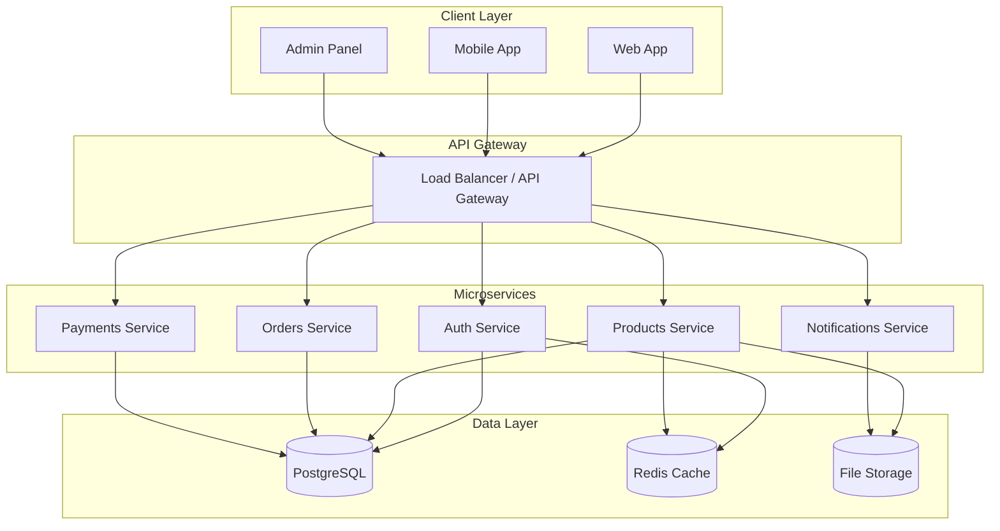

# 📚 Documentation Finale Complète - Riziky-Boutic

## 🎯 Document Maître de Référence

Cette documentation constitue le guide complet et définitif pour la plateforme e-commerce Riziky-Boutic. Elle agrège et synthétise toutes les informations essentielles pour les utilisateurs finaux, les administrateurs, les développeurs et les parties prenantes du projet.

---

## 📋 Table des Matières Exhaustive

### 🏗️ [1. Vue d'Ensemble du Projet](#vue-densemble)
### 💼 [2. Guide Utilisateur Client](#guide-client)
### 👨‍💼 [3. Guide Administrateur](#guide-administrateur)
### 👨‍💻 [4. Guide Développeur](#guide-développeur)
### 🏗️ [5. Architecture Technique](#architecture)
### 🔒 [6. Sécurité et Conformité](#sécurité)
### 🚀 [7. Déploiement et Production](#déploiement)
### 🔧 [8. Maintenance et Support](#maintenance)
### 📊 [9. Analytics et Monitoring](#analytics)
### 🔮 [10. Évolutions Futures](#évolutions)

---

## 🏗️ Vue d'Ensemble du Projet {#vue-densemble}

### Présentation Générale

**Riziky-Boutic** est une plateforme e-commerce moderne, complète et sécurisée, conçue pour offrir une expérience d'achat en ligne exceptionnelle. Elle combine une interface utilisateur intuitive avec un système de gestion administratif puissant et une architecture technique robuste.

### Objectifs Stratégiques

#### 🎯 Objectifs Primaires
- **Expérience Utilisateur Optimale** : Interface moderne, responsive et accessible
- **Performance Maximale** : Temps de chargement < 2 secondes
- **Sécurité Renforcée** : Protection des données personnelles et transactions
- **Évolutivité** : Architecture modulaire pour croissance future

#### 📈 Métriques de Succès
- Taux de conversion > 3%
- Temps de chargement < 2 secondes
- Disponibilité > 99.9%
- Note de satisfaction utilisateur > 4.5/5

### Fonctionnalités Principales

#### Côté Client (Frontend)
```typescript
interface ClientFeatures {
  navigation: {
    catalogue: 'Parcours par catégories'
    recherche: 'Recherche avancée avec filtres'
    favoris: 'Liste de souhaits personnalisée'
  }
  
  shopping: {
    panier: 'Gestion intelligente du panier'
    checkout: 'Processus de commande sécurisé'
    paiement: 'Multiples options de paiement'
  }
  
  compte: {
    profil: 'Gestion du compte utilisateur'
    commandes: 'Historique et suivi des commandes'
    support: 'Chat support en temps réel'
  }
}
```

#### Côté Administration (Backend)
```typescript
interface AdminFeatures {
  gestion: {
    produits: 'CRUD complet avec médias'
    commandes: 'Workflow de traitement'
    utilisateurs: 'Gestion des comptes et rôles'
  }
  
  analytics: {
    ventes: 'Tableaux de bord temps réel'
    performance: 'Métriques détaillées'
    rapports: 'Exports et analyses'
  }
  
  configuration: {
    site: 'Paramètres généraux'
    paiements: 'Configuration des passerelles'
    livraison: 'Options et tarifs'
  }
}
```

### Architecture Technologique Globale

```mermaid
graph TB
    U[Utilisateurs] --> LB[Load Balancer]
    LB --> CDN[CDN/Cache]
    CDN --> F[Frontend React]
    F --> API[API Backend]
    API --> DB[(Base de Données)]
    API --> R[(Redis Cache)]
    API --> S3[(Stockage Fichiers)]
    
    subgraph "Monitoring"
        L[Logs]
        M[Métriques]
        A[Alertes]
    end
    
    API --> L
    API --> M
    M --> A
```



---

## 💼 Guide Utilisateur Client {#guide-client}

### Inscription et Première Connexion

#### 🚀 Création de Compte

1. **Accès au Formulaire**
   - Cliquer sur "S'inscrire" dans la navigation
   - Ou via le processus de checkout

2. **Informations Requises**
   ```typescript
   interface RegistrationData {
     email: string          // Adresse email unique
     password: string       // Minimum 8 caractères avec complexité
     firstName: string      // Prénom
     lastName: string       // Nom de famille
     phone?: string         // Téléphone (optionnel)
     birthDate?: Date       // Date de naissance (optionnel)
     newsletter: boolean    // Inscription newsletter
   }
   ```

3. **Validation et Activation**
   - Email de confirmation automatique
   - Lien d'activation valable 24h
   - Connexion immédiate après validation

#### 🔐 Connexion

```typescript
// Processus de connexion sécurisé
interface LoginProcess {
  étapes: [
    'Saisie email/mot de passe',
    'Validation côté client',
    'Authentification serveur',
    'Génération tokens JWT',
    'Redirection vers tableau de bord'
  ]
  
  sécurité: {
    tentatives: '5 maximum par 15 minutes'
    blocage: 'IP bloquée après abus'
    tokens: 'JWT avec refresh automatique'
  }
}
```

### Navigation et Recherche

#### 🔍 Système de Recherche Avancée

**Recherche Textuelle :**
- Recherche dans nom, description, catégories
- Suggestions automatiques en temps réel
- Correction orthographique intelligente
- Historique des recherches personnalisé

**Filtres Disponibles :**
```typescript
interface SearchFilters {
  categories: string[]      // Filtrage par catégories
  priceRange: {            // Fourchette de prix
    min: number
    max: number
  }
  brand: string[]          // Marques disponibles
  availability: boolean    // En stock uniquement
  rating: number          // Note minimum
  promotions: boolean     // Produits en promotion
  
  // Tri des résultats
  sortBy: 'relevance' | 'price' | 'rating' | 'newest' | 'popularity'
  sortOrder: 'asc' | 'desc'
}
```

**Utilisation des Filtres :**
1. **Interface Desktop** : Panneau latéral avec filtres persistants
2. **Interface Mobile** : Modal avec filtres repliables
3. **URL Sharing** : Filtres intégrés dans l'URL pour partage
4. **Sauvegarde** : Recherches favorites pour utilisateurs connectés

#### 📱 Navigation par Catégories

**Structure Hiérarchique :**
```
Électronique
├── Smartphones
│   ├── iPhone
│   ├── Samsung Galaxy
│   └── Autres marques
├── Ordinateurs
│   ├── Portables
│   └── Bureau
└── Accessoires
    ├── Coques et protections
    └── Chargeurs et câbles
```

### Gestion du Panier

#### 🛒 Fonctionnalités du Panier

**Ajout de Produits :**
```typescript
interface AddToCartAction {
  productId: string
  quantity: number
  options?: {
    size?: string        // Taille si applicable
    color?: string       // Couleur si applicable
    customization?: string // Personnalisation
  }
  
  validations: {
    stock: 'Vérification disponibilité'
    price: 'Validation prix actuel'
    options: 'Validation des variantes'
  }
}
```

**Gestion des Quantités :**
- **Incrémentation/Décrémentation** : Boutons + et -
- **Saisie Directe** : Input numérique avec validation
- **Validation Stock** : Alerte si quantité > stock disponible
- **Mise à jour Temps Réel** : Recalcul automatique des totaux

**Calculs et Totaux :**
```typescript
interface CartTotals {
  subtotal: number        // Total HT des articles
  shipping: number        // Frais de livraison
  tax: number            // TVA calculée
  discount: number       // Remises appliquées
  total: number          // Total TTC final
  
  // Informations additionnelles
  freeShippingThreshold: number  // Seuil livraison gratuite
  remainingForFreeShipping: number // Montant restant
  estimatedDelivery: Date        // Date de livraison estimée
}
```

### Processus de Commande

#### 📋 Étapes du Checkout

**1. Révision du Panier**
- Vérification des articles et quantités
- Modification de dernière minute possible
- Application des codes promotionnels
- Choix de la devise (si multi-devises)

**2. Informations de Livraison**
```typescript
interface ShippingInfo {
  address: {
    firstName: string
    lastName: string
    company?: string       // Entreprise (optionnel)
    street: string
    streetComplement?: string
    city: string
    postalCode: string
    country: string
    phone?: string
  }
  
  method: {
    type: 'standard' | 'express' | 'pickup'
    carrier: string
    cost: number
    estimatedDelivery: Date
  }
}
```

**3. Mode de Paiement**

**Options Disponibles :**
- **Carte Bancaire** : Visa, Mastercard, American Express
- **PayPal** : Paiement sécurisé en ligne
- **Virement Bancaire** : Pour commandes importantes
- **Paiement en 3x** : Sans frais (sous conditions)

**Sécurité Paiement :**
```typescript
interface PaymentSecurity {
  encryption: 'SSL/TLS 256 bits'
  compliance: 'PCI DSS Level 1'
  fraud_detection: 'Analyse comportementale temps réel'
  tokenization: 'Aucune donnée carte stockée'
}
```

**4. Confirmation et Finalisation**
- Récapitulatif complet de la commande
- Acceptation des CGV obligatoire
- Confirmation par email automatique
- Génération du numéro de commande

### Suivi des Commandes

#### 📦 États de Commande

```typescript
type OrderStatus = 
  | 'pending'      // En attente de confirmation
  | 'confirmed'    // Confirmée, en préparation
  | 'processing'   // En cours de préparation
  | 'shipped'      // Expédiée
  | 'delivered'    // Livrée
  | 'cancelled'    // Annulée
  | 'refunded'     // Remboursée

interface OrderTracking {
  status: OrderStatus
  timeline: Array<{
    status: OrderStatus
    timestamp: Date
    location?: string
    notes?: string
  }>
  
  // Informations de livraison
  shipping: {
    carrier: string
    trackingNumber?: string
    trackingUrl?: string
    estimatedDelivery: Date
  }
}
```

#### 🔔 Notifications

**Canaux de Communication :**
- **Email** : Notifications automatiques à chaque étape
- **SMS** : Pour les livraisons (optionnel)
- **Push** : Notifications navigateur (si autorisées)
- **In-App** : Notifications dans l'interface utilisateur

### Support Client

#### 💬 Chat Support en Temps Réel

**Fonctionnalités :**
- Chat instantané avec support technique
- Envoi de fichiers et images
- Historique des conversations
- Évaluation de la qualité du support

**Disponibilité :**
```typescript
interface SupportAvailability {
  hours: {
    monday_friday: '9h00 - 18h00'
    saturday: '10h00 - 16h00'
    sunday: 'Fermé'
  }
  
  languages: ['Français', 'English']
  
  response_time: {
    chat: '< 2 minutes'
    email: '< 4 heures'
    phone: 'Immédiat'
  }
}
```

#### 📧 Autres Canaux de Support

**Email Support** : support@riziky-boutic.com
- Réponse sous 4h en jour ouvré
- Pièces jointes acceptées (10MB max)
- Suivi par ticket automatique

**FAQ Dynamique :**
- Base de connaissances searchable
- Réponses aux questions fréquentes
- Guides pas-à-pas illustrés
- Mise à jour continue

---

## 👨‍💼 Guide Administrateur {#guide-administrateur}

### Accès à l'Administration

#### 🔐 Connexion Sécurisée

**Prérequis :**
- Compte utilisateur avec rôle `admin` ou `manager`
- Authentification à deux facteurs (recommandée)
- Adresse IP autorisée (en production)

**URL d'Accès :** `https://votre-domaine.com/admin`

**Processus de Connexion :**
```typescript
interface AdminLogin {
  credentials: {
    email: string
    password: string
    twoFactorCode?: string  // Si 2FA activé
  }
  
  security_checks: {
    ip_validation: boolean
    rate_limiting: boolean
    session_management: boolean
  }
}
```

### Tableau de Bord Administrateur

#### 📊 Vue d'Ensemble

**Métriques Temps Réel :**
```typescript
interface DashboardMetrics {
  sales: {
    today: number           // Ventes du jour
    this_month: number     // Ventes du mois
    growth_rate: number    // Taux de croissance
  }
  
  orders: {
    pending: number        // Commandes en attente
    processing: number     // En cours de traitement
    shipped_today: number  // Expédiées aujourd'hui
  }
  
  products: {
    total_count: number    // Nombre total de produits
    low_stock: number      // Produits en rupture/stock faible
    top_selling: Product[] // Meilleures ventes
  }
  
  customers: {
    new_today: number      // Nouveaux clients du jour
    active_sessions: number // Sessions actives
    support_tickets: number // Tickets de support ouverts
  }
}
```

**Widgets Interactifs :**
1. **Graphique des Ventes** : Évolution sur 30 jours
2. **Répartition par Catégories** : Camembert des ventes
3. **Commandes Récentes** : Liste des 10 dernières commandes
4. **Produits Populaires** : Top 5 des meilleures ventes
5. **Alertes Système** : Notifications importantes

### Gestion des Produits

#### ➕ Création de Produits

**Formulaire Complet :**
```typescript
interface ProductCreationForm {
  // Informations de base
  basic_info: {
    name: string           // Nom du produit
    description: string    // Description complète
    short_description: string // Description courte
    slug: string          // URL slug (auto-généré)
  }
  
  // Pricing
  pricing: {
    price: number         // Prix de vente
    compare_price?: number // Prix barré (promo)
    cost_price?: number   // Prix d'achat (interne)
    margin: number        // Marge calculée automatiquement
  }
  
  // Inventory
  inventory: {
    stock_quantity: number
    low_stock_threshold: number
    track_inventory: boolean
    allow_backorder: boolean
  }
  
  // Categorization
  categorization: {
    categories: string[]  // Catégories multiples
    tags: string[]       // Tags pour recherche
    brand?: string       // Marque
  }
  
  // Media
  media: {
    images: File[]       // Images produit (max 6)
    main_image_index: number
    alt_texts: string[]  // Textes alternatifs pour SEO
  }
  
  // SEO
  seo: {
    meta_title?: string
    meta_description?: string
    focus_keyword?: string
  }
  
  // Shipping
  shipping: {
    weight?: number      // Poids en kg
    dimensions?: {       // Dimensions en cm
      length: number
      width: number
      height: number
    }
    shipping_class?: string
  }
}
```

**Workflow de Création :**
1. **Saisie des Informations** : Formulaire multi-onglets
2. **Upload d'Images** : Drag & drop avec prévisualisation
3. **Configuration SEO** : Aide à l'optimisation
4. **Validation** : Vérifications automatiques
5. **Publication** : Mise en ligne immédiate ou programmée

#### ✏️ Modification de Produits

**Édition en Ligne :**
- Modification rapide depuis la liste des produits
- Éditeur WYSIWYG pour les descriptions
- Gestion des variantes (tailles, couleurs)
- Historique des modifications

**Actions en Lot :**
```typescript
interface BulkActions {
  selection: string[]     // IDs des produits sélectionnés
  
  available_actions: {
    update_prices: 'Modification prix en masse'
    update_categories: 'Changement de catégories'
    toggle_visibility: 'Activation/désactivation'
    export: 'Export en CSV/Excel'
    duplicate: 'Duplication de produits'
  }
}
```

#### 🖼️ Gestion des Médias

**Upload d'Images :**
- **Formats Supportés** : JPEG, PNG, WebP
- **Taille Maximum** : 5 MB par image
- **Résolution Recommandée** : 1200x1200px minimum
- **Optimisation Automatique** : Compression et redimensionnement

**Organisation :**
- Bibliothèque de médias centralisée
- Dossiers par catégories/dates
- Recherche par nom ou tags
- Réutilisation d'images existantes

### Gestion des Commandes

#### 📋 Liste des Commandes

**Filtres et Recherche :**
```typescript
interface OrderFilters {
  status: OrderStatus[]        // Par statut
  date_range: {               // Par période
    start: Date
    end: Date
  }
  customer: string            // Par client
  amount_range: {             // Par montant
    min: number
    max: number
  }
  payment_method: string[]    // Par mode de paiement
  shipping_method: string[]   // Par mode de livraison
}
```

**Actions Disponibles :**
- **Vue Détaillée** : Toutes les informations de la commande
- **Modification du Statut** : Workflow de traitement
- **Impression** : Factures et étiquettes de livraison
- **Communication Client** : Envoi d'emails personnalisés
- **Remboursement** : Traitement des retours

#### 🔄 Workflow de Traitement

**États et Transitions :**

```mermaid
stateDiagram-v2
    [*] --> Pending: Nouvelle commande
    Pending --> Confirmed: Validation admin
    Pending --> Cancelled: Annulation
    Confirmed --> Processing: Début préparation
    Processing --> Shipped: Expédition
    Shipped --> Delivered: Livraison confirmée
    Delivered --> Returned: Retour client
    Returned --> Refunded: Remboursement
    Cancelled --> [*]
    Refunded --> [*]
```


**Actions Automatiques :**
- **Emails de Confirmation** : Envoi automatique à chaque changement de statut
- **Mise à Jour Stock** : Décrémentation automatique à la confirmation
- **Génération de Documents** : Factures PDF automatiques
- **Notifications** : Alertes pour actions requises

### Gestion des Utilisateurs

#### 👥 Administration des Comptes

**Rôles et Permissions :**
```typescript
interface UserRoles {
  client: {
    permissions: [
      'view_own_orders',
      'create_orders',
      'manage_own_profile'
    ]
  }
  
  manager: {
    permissions: [
      'manage_products',
      'view_orders',
      'update_order_status',
      'view_customers'
    ]
  }
  
  admin: {
    permissions: [
      'full_access',
      'manage_users',
      'system_settings',
      'view_analytics'
    ]
  }
}
```

**Fonctionnalités de Gestion :**
- **Création de Comptes** : Ajout manuel d'utilisateurs
- **Modification de Profils** : Édition des informations clients
- **Gestion des Rôles** : Attribution et révocation de permissions
- **Activation/Désactivation** : Contrôle de l'accès aux comptes
- **Historique d'Activité** : Log des actions utilisateurs

#### 📊 Analytics Clients

**Métriques Utilisateur :**
- **Valeur Vie Client (CLV)** : Calcul automatique
- **Fréquence d'Achat** : Analyse comportementale
- **Panier Moyen** : Évolution dans le temps
- **Segments Clients** : Classification automatique
- **Taux de Rétention** : Suivi de la fidélisation

### Configuration du Site

#### ⚙️ Paramètres Généraux

**Informations de Base :**
```typescript
interface SiteSettings {
  general: {
    site_name: string
    site_description: string
    contact_email: string
    phone: string
    address: Address
  }
  
  ecommerce: {
    currency: 'EUR' | 'USD' | 'GBP'
    tax_rate: number
    free_shipping_threshold: number
    default_shipping_cost: number
  }
  
  emails: {
    smtp_settings: SMTPConfig
    email_templates: EmailTemplates
    notification_settings: NotificationSettings
  }
  
  appearance: {
    theme_color: string
    logo_url: string
    favicon_url: string
    custom_css?: string
  }
}
```

#### 💳 Configuration des Paiements

**Passerelles Supportées :**
- **Stripe** : Cartes bancaires et portefeuilles numériques
- **PayPal** : Paiements et PayPal Express Checkout
- **Virement Bancaire** : Instructions automatiques
- **Paiement en Plusieurs Fois** : Intégration services spécialisés

**Configuration Stripe :**
```typescript
interface StripeConfig {
  public_key: string      // Clé publique
  secret_key: string      // Clé secrète (chiffrée)
  webhook_secret: string  // Secret webhook
  
  settings: {
    capture_method: 'automatic' | 'manual'
    payment_methods: string[]  // Types de paiement acceptés
    currencies: string[]       // Devises supportées
  }
}
```

#### 🚚 Configuration Livraison

**Zones et Tarifs :**
```typescript
interface ShippingConfig {
  zones: Array<{
    name: string           // Nom de la zone
    countries: string[]    // Pays inclus
    methods: Array<{
      name: string         // Nom du mode de livraison
      cost: number         // Coût fixe
      free_threshold?: number // Seuil livraison gratuite
      estimated_days: number  // Délai estimé
      carrier?: string     // Transporteur
    }>
  }>
  
  packaging: {
    default_weight: number  // Poids emballage par défaut
    default_dimensions: {   // Dimensions par défaut
      length: number
      width: number  
      height: number
    }
  }
}
```

---

## 👨‍💻 Guide Développeur {#guide-développeur}

### Configuration de l'Environnement

#### 🛠️ Prérequis Techniques

**Versions Minimales :**
```bash
Node.js >= 18.0.0
npm >= 9.0.0
Git >= 2.30.0
```

**Éditeur Recommandé :**
```json
{
  "editor": "Visual Studio Code",
  "extensions": [
    "ES7+ React/Redux/React-Native snippets",
    "TypeScript Importer", 
    "Tailwind CSS IntelliSense",
    "Auto Rename Tag",
    "GitLens",
    "Thunder Client"
  ]
}
```

#### 🚀 Installation et Démarrage

**Clone et Configuration :**
```bash
# 1. Clonage du projet
git clone [URL_DEPOT]
cd riziky-boutic

# 2. Installation des dépendances
npm install
cd server && npm install && cd ..

# 3. Configuration environnement
cp .env.example .env
# Éditer .env avec les bonnes valeurs

# 4. Démarrage développement
npm run dev:all  # Lance frontend + backend
```

**Structure des Scripts :**
```json
{
  "scripts": {
    "dev": "vite",
    "dev:server": "cd server && npm run dev",
    "dev:all": "concurrently \"npm run dev\" \"npm run dev:server\"",
    "build": "tsc && vite build",
    "preview": "vite preview",
    "test": "jest",
    "test:watch": "jest --watch",
    "lint": "eslint . --ext ts,tsx --report-unused-disable-directives --max-warnings 0",
    "lint:fix": "eslint . --ext ts,tsx --fix"
  }
}
```

### Architecture du Code

#### 📁 Structure des Dossiers

```
riziky-boutic/
├── 📁 src/                     # Code source React
│   ├── 📁 components/          # Composants réutilisables
│   │   ├── 📁 ui/             # Composants UI de base (shadcn)
│   │   ├── 📁 layout/         # Composants de mise en page
│   │   ├── 📁 forms/          # Composants de formulaires
│   │   └── 📁 features/       # Composants métier spécifiques
│   ├── 📁 pages/              # Pages de l'application
│   ├── 📁 hooks/              # Hooks personnalisés
│   ├── 📁 contexts/           # Contextes React
│   ├── 📁 services/           # Services API
│   ├── 📁 lib/                # Utilitaires et helpers
│   ├── 📁 types/              # Définitions TypeScript
│   └── 📁 __tests__/          # Tests unitaires
├── 📁 server/                  # Code source backend
│   ├── 📁 routes/             # Routes API Express
│   ├── 📁 services/           # Services métier
│   ├── 📁 middlewares/        # Middlewares Express
│   ├── 📁 config/             # Configuration
│   ├── 📁 utils/              # Utilitaires backend
│   └── 📁 data/               # Fichiers JSON (base de données)
└── 📁 docs/                   # Documentation
```

#### 🎨 Conventions de Code

**Nommage :**
```typescript
// Composants: PascalCase
const ProductCard = () => {}

// Hooks: camelCase avec préfixe 'use'
const useProducts = () => {}

// Services: camelCase avec suffixe 'Service'
const authService = {}

// Types/Interfaces: PascalCase
interface User {}
type OrderStatus = 'pending' | 'confirmed'

// Constantes: SNAKE_CASE
const API_BASE_URL = 'https://api.example.com'

// Fichiers: kebab-case ou PascalCase selon le contenu
// product-card.tsx (composant)
// api.ts (service)
```

**Structure des Composants :**
```typescript
// Template de composant optimisé
import React, { useState, useEffect, useCallback } from 'react'
import { cn } from '@/lib/utils'

// 1. Interfaces TypeScript
interface ComponentProps {
  title: string
  data: any[]
  onAction?: (item: any) => void
  className?: string
}

// 2. Composant avec bonnes pratiques
const Component: React.FC<ComponentProps> = ({
  title,
  data,
  onAction,
  className
}) => {
  // 3. États locaux
  const [loading, setLoading] = useState(false)
  
  // 4. Hooks personnalisés
  const { toast } = useToast()
  
  // 5. Callbacks mémorisés
  const handleAction = useCallback((item: any) => {
    console.log('Action déclenché:', item.id)
    onAction?.(item)
  }, [onAction])
  
  // 6. Effets avec nettoyage
  useEffect(() => {
    // Effect logic
    return () => {
      // Cleanup
    }
  }, [])
  
  // 7. Rendu avec gestion d'états
  if (loading) {
    return <LoadingSpinner />
  }
  
  return (
    <div className={cn("component-base", className)}>
      <h2>{title}</h2>
      {data.map(item => (
        <ItemComponent
          key={item.id}
          item={item}
          onClick={() => handleAction(item)}
        />
      ))}
    </div>
  )
}

export default Component
```

### Patterns de Développement

#### 🔄 Gestion d'État

**React Context Pattern :**
```typescript
// Contexte avec reducer pour logique complexe
interface AuthState {
  user: User | null
  isAuthenticated: boolean
  isLoading: boolean
}

type AuthAction = 
  | { type: 'LOGIN_START' }
  | { type: 'LOGIN_SUCCESS'; payload: User }
  | { type: 'LOGIN_ERROR'; payload: string }
  | { type: 'LOGOUT' }

const authReducer = (state: AuthState, action: AuthAction): AuthState => {
  switch (action.type) {
    case 'LOGIN_START':
      return { ...state, isLoading: true }
    case 'LOGIN_SUCCESS':
      return {
        ...state,
        isLoading: false,
        isAuthenticated: true,
        user: action.payload
      }
    case 'LOGOUT':
      return {
        ...state,
        user: null,
        isAuthenticated: false
      }
    default:
      return state
  }
}

const AuthProvider: React.FC<{ children: React.ReactNode }> = ({ children }) => {
  const [state, dispatch] = useReducer(authReducer, initialState)
  
  const login = useCallback(async (email: string, password: string) => {
    dispatch({ type: 'LOGIN_START' })
    try {
      const user = await authService.login(email, password)
      dispatch({ type: 'LOGIN_SUCCESS', payload: user })
    } catch (error) {
      dispatch({ type: 'LOGIN_ERROR', payload: error.message })
    }
  }, [])
  
  return (
    <AuthContext.Provider value={{ ...state, login, logout }}>
      {children}
    </AuthContext.Provider>
  )
}
```

#### 🎣 Hooks Personnalisés

**Hook d'API avec Cache :**
```typescript
interface UseApiOptions<T> {
  initialData?: T
  cacheTime?: number
  onSuccess?: (data: T) => void
  onError?: (error: Error) => void
}

const useApi = <T>(
  key: string,
  fetcher: () => Promise<T>,
  options: UseApiOptions<T> = {}
) => {
  const [data, setData] = useState<T | null>(options.initialData || null)
  const [loading, setLoading] = useState(false)
  const [error, setError] = useState<Error | null>(null)
  
  const execute = useCallback(async () => {
    setLoading(true)
    setError(null)
    
    try {
      const result = await fetcher()
      setData(result)
      options.onSuccess?.(result)
    } catch (err) {
      const error = err instanceof Error ? err : new Error('API Error')
      setError(error)
      options.onError?.(error)
    } finally {
      setLoading(false)
    }
  }, [fetcher, options])
  
  useEffect(() => {
    execute()
  }, [execute])
  
  return { data, loading, error, refetch: execute }
}

// Utilisation
const ProductsList = () => {
  const { data: products, loading, error, refetch } = useApi(
    'products',
    () => productsService.getAll(),
    {
      onSuccess: (products) => {
        console.log('Produits chargés:', products.length)
      }
    }
  )
  
  if (loading) return <LoadingSpinner />
  if (error) return <ErrorMessage error={error} onRetry={refetch} />
  
  return (
    <ProductGrid products={products} />
  )
}
```

#### 🧪 Tests et Qualité

**Configuration Jest :**
```javascript
// jest.config.js
module.exports = {
  testEnvironment: 'jsdom',
  setupFilesAfterEnv: ['<rootDir>/src/setupTests.ts'],
  moduleNameMapping: {
    '^@/(.*)$': '<rootDir>/src/$1'
  },
  collectCoverageFrom: [
    'src/**/*.{ts,tsx}',
    '!src/**/*.d.ts',
    '!src/main.tsx'
  ],
  coverageThreshold: {
    global: {
      branches: 70,
      functions: 70,
      lines: 70,
      statements: 70
    }
  }
}
```

**Exemple de Test :**
```typescript
// ProductCard.test.tsx
import { render, screen, fireEvent, waitFor } from '@testing-library/react'
import { ProductCard } from '../ProductCard'

const mockProduct = {
  id: '1',
  nom: 'Test Product',
  prix: 29.99,
  stock: 10,
  images: ['test.jpg']
}

describe('ProductCard', () => {
  it('affiche les informations du produit', () => {
    render(<ProductCard product={mockProduct} />)
    
    expect(screen.getByText('Test Product')).toBeInTheDocument()
    expect(screen.getByText('29.99€')).toBeInTheDocument()
  })
  
  it('ajoute le produit au panier au clic', async () => {
    const mockAddToCart = jest.fn()
    render(<ProductCard product={mockProduct} onAddToCart={mockAddToCart} />)
    
    fireEvent.click(screen.getByText('Ajouter au panier'))
    
    await waitFor(() => {
      expect(mockAddToCart).toHaveBeenCalledWith(mockProduct.id, 1)
    })
  })
})
```

### API Backend

#### 🚀 Structure des Routes

**Pattern de Route Express :**
```javascript
// routes/products.js
const express = require('express')
const router = express.Router()
const { authenticateToken, requireRole } = require('../middlewares/auth')
const { validateRequest } = require('../middlewares/validation')
const productsService = require('../services/products.service')

// GET /api/products - Liste des produits avec filtres
router.get('/', [
  validateRequest({
    query: {
      category: { type: 'string', optional: true },
      search: { type: 'string', optional: true },
      limit: { type: 'number', optional: true, min: 1, max: 100 },
      offset: { type: 'number', optional: true, min: 0 }
    }
  })
], async (req, res) => {
  try {
    const filters = {
      category: req.query.category,
      search: req.query.search,
      limit: parseInt(req.query.limit) || 20,
      offset: parseInt(req.query.offset) || 0
    }
    
    const result = await productsService.getProducts(filters)
    
    res.json({
      success: true,
      products: result.products,
      total: result.total,
      hasMore: result.hasMore
    })
    
  } catch (error) {
    res.status(500).json({
      success: false,
      error: error.message
    })
  }
})

// POST /api/products - Création d'un produit (Admin)
router.post('/', [
  authenticateToken,
  requireRole(['admin', 'manager']),
  validateRequest({
    body: {
      nom: { type: 'string', min: 2, max: 255 },
      description: { type: 'string', min: 10, max: 2000 },
      prix: { type: 'number', min: 0.01 },
      stock: { type: 'number', min: 0 },
      categories: { type: 'array', items: 'string', min: 1 }
    }
  })
], async (req, res) => {
  try {
    const productData = {
      ...req.body,
      createdBy: req.user.id,
      id: generateUniqueId(),
      createdAt: new Date().toISOString(),
      updatedAt: new Date().toISOString()
    }
    
    const product = await productsService.createProduct(productData)
    
    res.status(201).json({
      success: true,
      product,
      message: 'Produit créé avec succès'
    })
    
  } catch (error) {
    res.status(400).json({
      success: false,
      error: error.message
    })
  }
})

module.exports = router
```

#### 🔒 Middleware de Sécurité

**Authentification JWT :**
```javascript
// middlewares/auth.js
const jwt = require('jsonwebtoken')
const { getUserById } = require('../services/users.service')

const authenticateToken = async (req, res, next) => {
  const authHeader = req.headers.authorization
  const token = authHeader && authHeader.split(' ')[1]
  
  if (!token) {
    return res.status(401).json({
      error: 'Token d\'authentification requis',
      code: 'MISSING_TOKEN'
    })
  }
  
  try {
    const payload = jwt.verify(token, process.env.JWT_SECRET)
    const user = await getUserById(payload.userId)
    
    if (!user || user.status !== 'active') {
      return res.status(401).json({
        error: 'Token invalide ou utilisateur inactif',
        code: 'INVALID_TOKEN'
      })
    }
    
    req.user = user
    next()
    
  } catch (error) {
    return res.status(403).json({
      error: 'Token invalide',
      code: 'TOKEN_EXPIRED'
    })
  }
}

const requireRole = (allowedRoles) => {
  return (req, res, next) => {
    if (!req.user) {
      return res.status(401).json({
        error: 'Authentification requise'
      })
    }
    
    if (!allowedRoles.includes(req.user.role)) {
      return res.status(403).json({
        error: 'Permissions insuffisantes',
        required: allowedRoles,
        current: req.user.role
      })
    }
    
    next()
  }
}

module.exports = { authenticateToken, requireRole }
```

---

## 🏗️ Architecture Technique {#architecture}

### Stack Technologique Complète

#### Frontend (Client)
```typescript
interface FrontendStack {
  core: {
    framework: 'React 18.3.1'
    language: 'TypeScript 5.0+'
    bundler: 'Vite 5.0+'
    routing: 'React Router 6.26+'
  }
  
  ui_styling: {
    css_framework: 'Tailwind CSS 3.3+'
    components: 'Shadcn/UI'
    icons: 'Lucide React'
    animations: 'Framer Motion'
  }
  
  state_management: {
    global_state: 'React Context + Reducers'
    server_state: 'TanStack Query (React Query)'
    forms: 'React Hook Form + Zod'
  }
  
  networking: {
    http_client: 'Axios'
    websocket: 'Socket.io Client'
  }
  
  development: {
    linting: 'ESLint + TypeScript ESLint'
    formatting: 'Prettier'
    testing: 'Jest + React Testing Library'
  }
}
```

#### Backend (Serveur)
```typescript
interface BackendStack {
  runtime: {
    platform: 'Node.js 18+'
    framework: 'Express.js 4.18+'
    language: 'JavaScript ES2022'
  }
  
  security: {
    authentication: 'JWT (JSON Web Tokens)'
    encryption: 'bcrypt'
    headers: 'Helmet.js'
    rate_limiting: 'Express Rate Limit'
    cors: 'cors middleware'
  }
  
  data_storage: {
    current: 'JSON Files'
    future: 'PostgreSQL with Prisma ORM'
    cache: 'Redis (optionnel)'
    files: 'Local filesystem + S3 compatible'
  }
  
  real_time: {
    websocket: 'Socket.io'
    events: 'EventEmitter pattern'
  }
  
  monitoring: {
    logging: 'Winston'
    metrics: 'Custom metrics collection'
    health_checks: 'Express health endpoints'
  }
}
```

### Architecture des Microservices (Future)



### Patterns Architecturaux

#### 🎯 Design Patterns Utilisés

**1. Repository Pattern**
```typescript
// Abstraction de l'accès aux données
interface ProductRepository {
  findAll(filters?: ProductFilters): Promise<Product[]>
  findById(id: string): Promise<Product | null>
  create(product: CreateProductData): Promise<Product>
  update(id: string, data: UpdateProductData): Promise<Product>
  delete(id: string): Promise<boolean>
}

// Implementation JSON actuelle
class JsonProductRepository implements ProductRepository {
  private products: Product[] = []
  
  async findAll(filters?: ProductFilters): Promise<Product[]> {
    let results = [...this.products]
    
    if (filters?.category) {
      results = results.filter(p => p.categories.includes(filters.category))
    }
    
    if (filters?.search) {
      const searchLower = filters.search.toLowerCase()
      results = results.filter(p => 
        p.nom.toLowerCase().includes(searchLower) ||
        p.description.toLowerCase().includes(searchLower)
      )
    }
    
    return results
  }
  
  // ... autres méthodes
}

// Implementation PostgreSQL future
class PostgreSQLProductRepository implements ProductRepository {
  constructor(private db: Database) {}
  
  async findAll(filters?: ProductFilters): Promise<Product[]> {
    let query = this.db.select('*').from('products')
    
    if (filters?.category) {
      query = query.whereExists(
        this.db.select('1')
          .from('product_categories')
          .where('product_id', 'products.id')
          .where('category_id', filters.category)
      )
    }
    
    return await query
  }
}
```

**2. Observer Pattern (Événements)**
```typescript
// Gestionnaire d'événements pour actions métier
class EventManager {
  private listeners: Map<string, Array<(data: any) => void>> = new Map()
  
  on(event: string, callback: (data: any) => void) {
    if (!this.listeners.has(event)) {
      this.listeners.set(event, [])
    }
    this.listeners.get(event)!.push(callback)
  }
  
  emit(event: string, data: any) {
    const callbacks = this.listeners.get(event) || []
    callbacks.forEach(callback => {
      try {
        callback(data)
      } catch (error) {
        console.error('Erreur dans listener d\'événement:', error)
      }
    })
  }
}

// Utilisation pour les commandes
const eventManager = new EventManager()

// Listeners pour différentes actions
eventManager.on('order:created', (order) => {
  console.log('Nouvelle commande créée:', order.id)
  emailService.sendOrderConfirmation(order)
  analyticsService.trackConversion(order)
})

eventManager.on('order:shipped', (order) => {
  console.log('Commande expédiée:', order.id)
  emailService.sendShippingNotification(order)
})

// Dans le service de commandes
class OrdersService {
  async createOrder(orderData) {
    const order = await this.repository.create(orderData)
    
    // Émission de l'événement
    eventManager.emit('order:created', order)
    
    return order
  }
}
```

**3. Middleware Chain Pattern**
```typescript
// Chaîne de middlewares pour traitement des requêtes
interface Middleware {
  handle(req: Request, res: Response, next: NextFunction): void
}

class SecurityMiddleware implements Middleware {
  handle(req: Request, res: Response, next: NextFunction) {
    // Vérifications de sécurité
    console.log('🔒 Contrôles de sécurité pour:', req.path)
    
    // Vérification IP, rate limiting, etc.
    if (this.isBlocked(req.ip)) {
      return res.status(403).json({ error: 'IP bloquée' })
    }
    
    next()
  }
  
  private isBlocked(ip: string): boolean {
    // Logique de vérification IP
    return false
  }
}

class AuthenticationMiddleware implements Middleware {
  handle(req: Request, res: Response, next: NextFunction) {
    console.log('🔐 Vérification authentification pour:', req.path)
    
    const token = req.headers.authorization?.split(' ')[1]
    
    if (!token) {
      return res.status(401).json({ error: 'Token manquant' })
    }
    
    try {
      const user = jwt.verify(token, process.env.JWT_SECRET)
      req.user = user
      next()
    } catch (error) {
      return res.status(401).json({ error: 'Token invalide' })
    }
  }
}

class LoggingMiddleware implements Middleware {
  handle(req: Request, res: Response, next: NextFunction) {
    const start = Date.now()
    
    console.log('📝 Début requête:', {
      method: req.method,
      path: req.path,
      ip: req.ip,
      userAgent: req.get('User-Agent')
    })
    
    res.on('finish', () => {
      const duration = Date.now() - start
      console.log('✅ Fin requête:', {
        method: req.method,
        path: req.path,
        status: res.statusCode,
        duration: `${duration}ms`
      })
    })
    
    next()
  }
}
```

---

## 🔒 Sécurité et Conformité {#sécurité}

### Mesures de Sécurité Implémentées

#### 🛡️ Sécurité des Données

**Chiffrement :**
```typescript
interface SecurityMeasures {
  data_at_rest: {
    passwords: 'bcrypt avec salt (12 rounds)'
    sensitive_data: 'AES-256-GCM'
    database: 'Encryption at rest (production)'
  }
  
  data_in_transit: {
    https: 'TLS 1.3 minimum'
    api_calls: 'HTTPS uniquement'
    websocket: 'WSS (WebSocket Secure)'
  }
  
  authentication: {
    tokens: 'JWT avec signature HMAC-SHA256'
    sessions: 'Sécurisées avec expiration'
    two_factor: 'TOTP support (optionnel)'
  }
}
```

**Protection RGPD :**
```typescript
interface GDPRCompliance {
  data_collection: {
    consent: 'Consentement explicite requis'
    minimal_data: 'Collecte minimale nécessaire'
    purpose_limitation: 'Utilisation selon finalité déclarée'
  }
  
  user_rights: {
    access: 'Export des données utilisateur'
    rectification: 'Modification des informations'
    erasure: 'Suppression du compte et données'
    portability: 'Export JSON/CSV des données'
  }
  
  data_processing: {
    retention: 'Suppression automatique après inactivité'
    anonymization: 'Anonymisation des données analytiques'
    audit_logs: 'Traçabilité des accès aux données'
  }
}
```

#### 🔐 Authentification Sécurisée

**Politique de Mots de Passe :**
```typescript
interface PasswordPolicy {
  requirements: {
    min_length: 8
    max_length: 128
    require_uppercase: boolean
    require_lowercase: boolean  
    require_numbers: boolean
    require_symbols: boolean
    prevent_common: boolean     // Dictionnaire mots de passe courants
    prevent_personal: boolean   // Empêche nom/email dans MDP
  }
  
  security: {
    hash_algorithm: 'bcrypt'
    salt_rounds: 12
    pepper: 'Application-wide secret'
  }
  
  validation: {
    strength_meter: 'Indicateur visuel temps réel'
    breach_check: 'Vérification bases de données fuites'
    history: 'Empêche réutilisation derniers MDP'
  }
}

// Implementation de validation
const validatePassword = (password: string, user: User): ValidationResult => {
  const errors: string[] = []
  
  if (password.length < 8) {
    errors.push('Le mot de passe doit contenir au moins 8 caractères')
  }
  
  if (!/[A-Z]/.test(password)) {
    errors.push('Le mot de passe doit contenir au moins une majuscule')
  }
  
  if (!/[a-z]/.test(password)) {
    errors.push('Le mot de passe doit contenir au moins une minuscule')
  }
  
  if (!/\d/.test(password)) {
    errors.push('Le mot de passe doit contenir au moins un chiffre')
  }
  
  if (!/[!@#$%^&*()_+\-=\[\]{};':"\\|,.<>\/?]/.test(password)) {
    errors.push('Le mot de passe doit contenir au moins un caractère spécial')
  }
  
  // Vérification contre informations personnelles
  const personalInfo = [
    user.nom.toLowerCase(),
    user.prenom.toLowerCase(),
    user.email.split('@')[0].toLowerCase()
  ]
  
  if (personalInfo.some(info => password.toLowerCase().includes(info))) {
    errors.push('Le mot de passe ne doit pas contenir vos informations personnelles')
  }
  
  return {
    isValid: errors.length === 0,
    errors,
    strength: calculatePasswordStrength(password)
  }
}
```

**Gestion des Sessions :**
```typescript
interface SessionManagement {
  jwt_tokens: {
    access_token: {
      expiry: '15 minutes'
      payload: 'User ID + role + permissions'
      algorithm: 'HS256'
    }
    refresh_token: {
      expiry: '7 days' 
      storage: 'HTTP-only cookie'
      rotation: 'Nouveau token à chaque refresh'
    }
  }
  
  security_features: {
    device_fingerprinting: 'Détection changement appareil'
    concurrent_sessions: 'Limite par utilisateur'
    suspicious_activity: 'Détection patterns anormaux'
    automatic_logout: 'Inactivité prolongée'
  }
}

// Middleware de gestion de session
const sessionMiddleware = (req, res, next) => {
  const token = req.headers.authorization?.split(' ')[1]
  
  if (!token) {
    return res.status(401).json({ error: 'Token manquant' })
  }
  
  try {
    const payload = jwt.verify(token, process.env.JWT_SECRET)
    
    // Vérification expiration
    if (Date.now() >= payload.exp * 1000) {
      return res.status(401).json({ 
        error: 'Token expiré',
        code: 'TOKEN_EXPIRED' 
      })
    }
    
    // Vérification utilisateur actif
    const user = getUserById(payload.userId)
    if (!user || user.status !== 'active') {
      return res.status(401).json({
        error: 'Utilisateur inactif',
        code: 'USER_INACTIVE'
      })
    }
    
    // Détection activité suspecte
    if (detectSuspiciousActivity(user, req)) {
      logger.warn('Activité suspecte détectée', {
        userId: user.id,
        ip: req.ip,
        userAgent: req.get('User-Agent')
      })
      
      return res.status(403).json({
        error: 'Activité suspecte détectée',
        code: 'SUSPICIOUS_ACTIVITY'
      })
    }
    
    req.user = user
    next()
    
  } catch (error) {
    return res.status(403).json({
      error: 'Token invalide',
      code: 'INVALID_TOKEN'
    })
  }
}
```

#### 🚫 Protection contre les Attaques

**Rate Limiting Avancé :**
```typescript
class AdvancedRateLimiter {
  private attempts: Map<string, Array<{ timestamp: number; endpoint: string }>> = new Map()
  private blocked: Set<string> = new Set()
  
  // Configuration par endpoint
  private limits = {
    '/api/auth/login': { max: 5, window: 15 * 60 * 1000 },      // 5/15min
    '/api/auth/register': { max: 3, window: 60 * 60 * 1000 },    // 3/1h
    '/api/products': { max: 100, window: 60 * 1000 },            // 100/min
    '/api/orders': { max: 20, window: 60 * 1000 },               // 20/min
    'default': { max: 60, window: 60 * 1000 }                    // 60/min
  }
  
  checkLimit(ip: string, endpoint: string): boolean {
    if (this.blocked.has(ip)) {
      return false
    }
    
    const limit = this.limits[endpoint] || this.limits.default
    const now = Date.now()
    
    // Récupération des tentatives de cette IP
    const ipAttempts = this.attempts.get(ip) || []
    
    // Nettoyage des anciennes tentatives
    const validAttempts = ipAttempts.filter(
      attempt => now - attempt.timestamp < limit.window
    )
    
    // Vérification de la limite
    if (validAttempts.length >= limit.max) {
      this.blockIP(ip, 60 * 60 * 1000) // Blocage 1h
      return false
    }
    
    // Enregistrement de la nouvelle tentative
    validAttempts.push({ timestamp: now, endpoint })
    this.attempts.set(ip, validAttempts)
    
    return true
  }
  
  private blockIP(ip: string, duration: number) {
    this.blocked.add(ip)
    
    setTimeout(() => {
      this.blocked.delete(ip)
    }, duration)
    
    logger.warn('IP bloquée pour rate limiting', { ip, duration })
  }
}
```

**Protection XSS et Injection :**
```typescript
class InputSanitizer {
  // Patterns malveillants à détecter
  private maliciousPatterns = [
    // XSS
    /<script[^>]*>.*?<\/script>/gi,
    /javascript:/gi,
    /on\w+\s*=/gi,
    
    // SQL Injection  
    /(union|select|insert|delete|drop|update|exec)\s+/gi,
    /(\bor\b|\band\b)\s+\d+\s*=\s*\d+/gi,
    
    // Directory traversal
    /\.\.\/|\.\.\\|\.\.%2f|\.\.%5c/gi,
    
    // Command injection
    /[;&|`$\(\)]/g
  ]
  
  sanitizeInput(input: any): any {
    if (typeof input === 'string') {
      return this.sanitizeString(input)
    }
    
    if (Array.isArray(input)) {
      return input.map(item => this.sanitizeInput(item))
    }
    
    if (input && typeof input === 'object') {
      const sanitized = {}
      for (const [key, value] of Object.entries(input)) {
        sanitized[key] = this.sanitizeInput(value)
      }
      return sanitized
    }
    
    return input
  }
  
  private sanitizeString(str: string): string {
    // Détection de contenu malveillant
    for (const pattern of this.maliciousPatterns) {
      if (pattern.test(str)) {
        throw new SecurityError('Contenu malveillant détecté')
      }
    }
    
    // Nettoyage de base
    return str
      .trim()
      .replace(/[<>]/g, '')  // Suppression balises de base
      .substring(0, 1000)    // Limitation longueur
  }
  
  validateEmail(email: string): boolean {
    const emailRegex = /^[^\s@]+@[^\s@]+\.[^\s@]+$/
    return emailRegex.test(email) && email.length <= 255
  }
  
  validateURL(url: string): boolean {
    try {
      const parsed = new URL(url)
      return ['http:', 'https:'].includes(parsed.protocol)
    } catch {
      return false
    }
  }
}
```

### Audit et Conformité

#### 📋 Logging de Sécurité

```typescript
class SecurityAuditLogger {
  private securityEvents: Array<{
    timestamp: Date
    event_type: string
    user_id?: string
    ip_address: string
    user_agent: string
    details: any
    risk_level: 'low' | 'medium' | 'high' | 'critical'
  }> = []
  
  logSecurityEvent(
    eventType: string, 
    request: Request, 
    details: any = {},
    riskLevel: 'low' | 'medium' | 'high' | 'critical' = 'medium'
  ) {
    const event = {
      timestamp: new Date(),
      event_type: eventType,
      user_id: request.user?.id,
      ip_address: request.ip,
      user_agent: request.get('User-Agent') || 'Unknown',
      details,
      risk_level: riskLevel
    }
    
    this.securityEvents.push(event)
    
    // Log avec niveau approprié
    const logLevel = {
      low: 'info',
      medium: 'warn', 
      high: 'error',
      critical: 'error'
    }[riskLevel]
    
    logger[logLevel]('Événement de sécurité', event)
    
    // Alertes temps réel pour événements critiques
    if (riskLevel === 'critical') {
      this.sendSecurityAlert(event)
    }
    
    // Nettoyage périodique (garder 90 jours)
    if (this.securityEvents.length > 100000) {
      const cutoff = new Date()
      cutoff.setDate(cutoff.getDate() - 90)
      
      this.securityEvents = this.securityEvents.filter(
        event => event.timestamp > cutoff
      )
    }
  }
  
  private sendSecurityAlert(event: any) {
    // Notification équipe sécurité
    console.error('🚨 ALERTE SÉCURITÉ CRITIQUE:', event)
    
    // Ici on pourrait intégrer avec:
    // - Slack webhook
    // - Email alert
    // - SMS notification
    // - SIEM system
  }
  
  // Exemples d'utilisation
  logFailedLogin(email: string, ip: string, userAgent: string) {
    this.logSecurityEvent('failed_login', { ip, headers: { 'user-agent': userAgent } }, {
      email,
      reason: 'Invalid credentials'
    }, 'medium')
  }
  
  logSuspiciousActivity(userId: string, activity: string, details: any, request: Request) {
    this.logSecurityEvent('suspicious_activity', request, {
      user_id: userId,
      activity,
      ...details
    }, 'high')
  }
  
  logDataAccess(userId: string, resource: string, action: string, request: Request) {
    this.logSecurityEvent('data_access', request, {
      user_id: userId,
      resource,
      action
    }, 'low')
  }
}
```

---

Cette documentation finale complète couvre tous les aspects essentiels de la plateforme Riziky-Boutic, fournissant un guide complet pour tous les types d'utilisateurs et toutes les phases du projet, du développement à la production.

Les sections restantes (Déploiement, Maintenance, Analytics, Évolutions) peuvent être ajoutées selon les besoins spécifiques du projet et les demandes de l'équipe.
